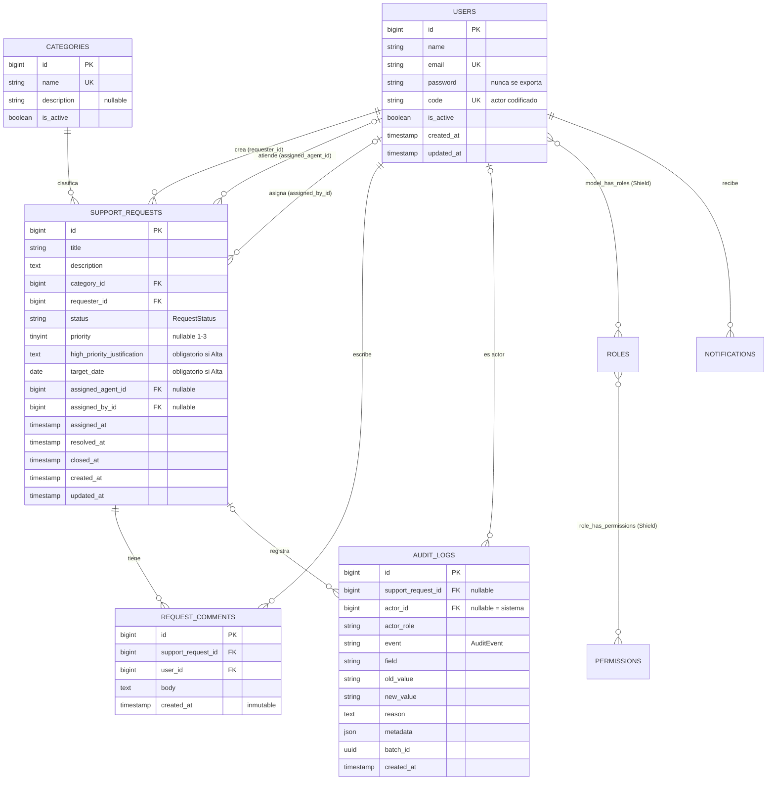
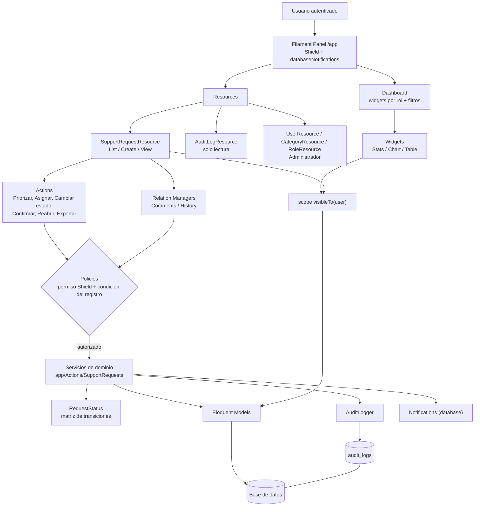
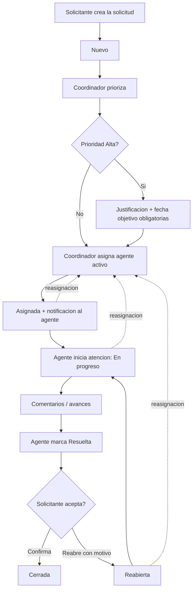
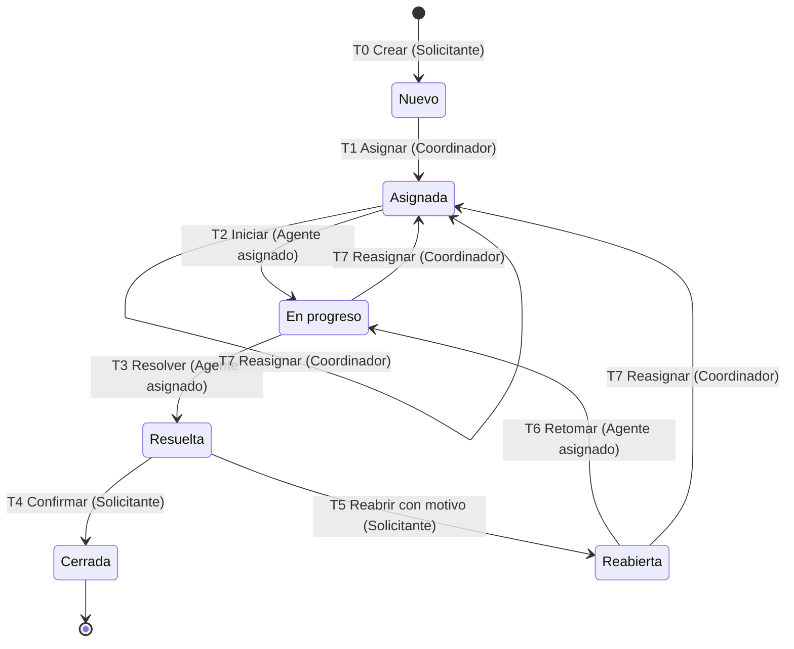
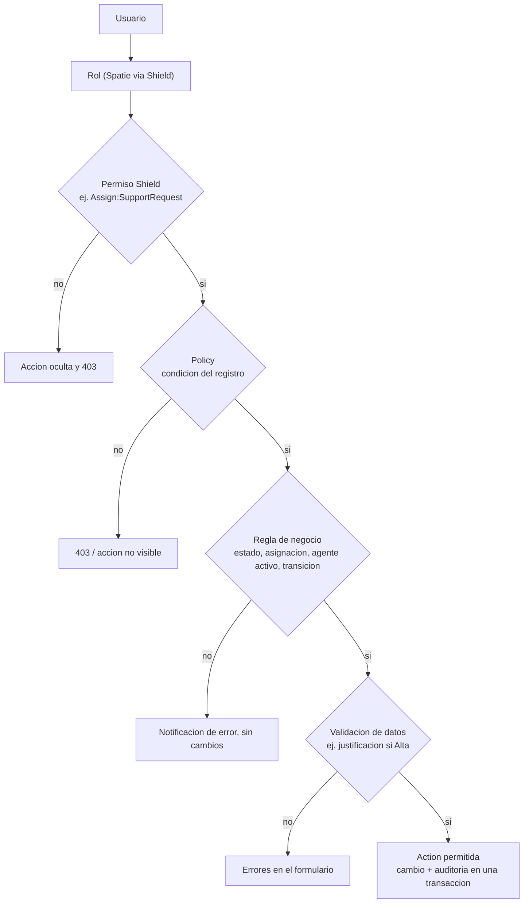
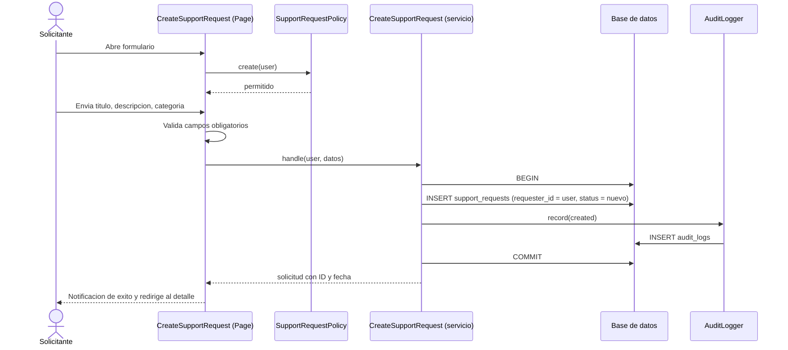
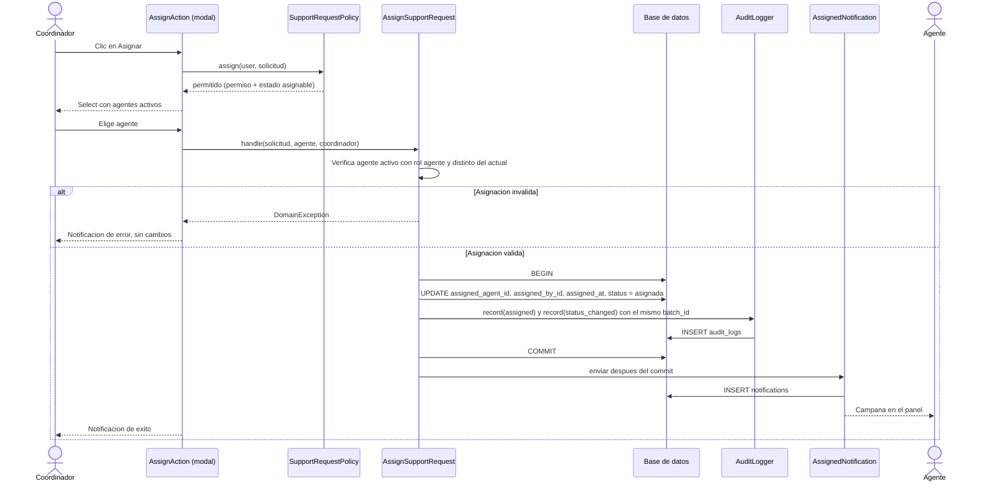
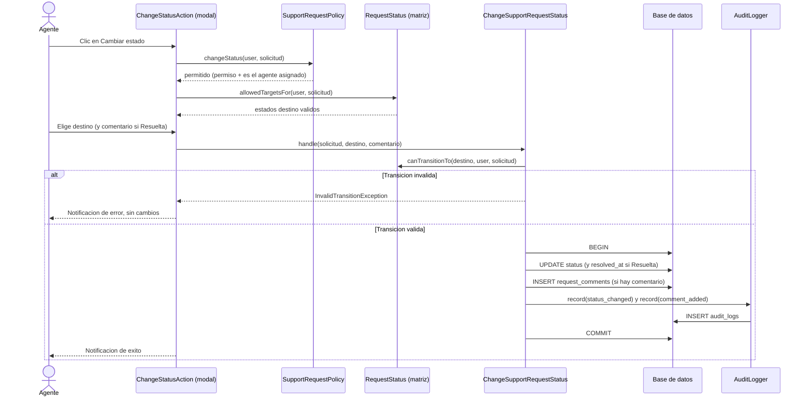
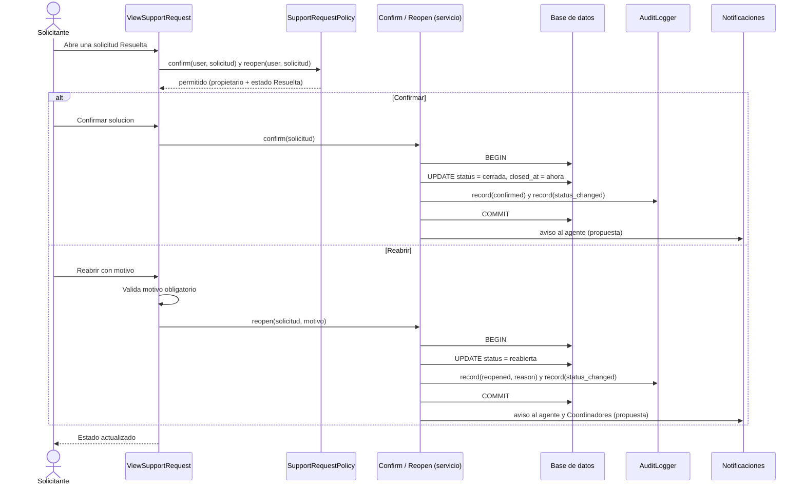
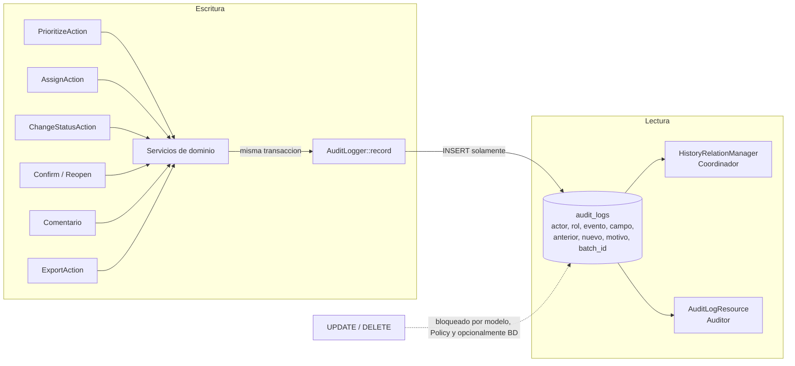

# Plan Técnico — Plataforma de Gestión Colaborativa de Solicitudes de Soporte

Laravel 13 · Filament 5 · Filament Shield — Sep 27, 2026 · @Emmanuel

## 1. Resumen ejecutivo

La plataforma se resuelve con **un solo panel Filament**, **4 modelos de dominio** (User, Category, SupportRequest, RequestComment) más **1 modelo de auditoría** (AuditLog), y **un Resource central** (`SupportRequestResource`) donde viven casi todas las historias mediante Actions, Tabs, Filters y Relation Managers.

El núcleo técnico son tres piezas que no dependen de la UI:

- **Una máquina de estados simple** (enum PHP con matriz de transiciones) que valida cada cambio de estado según estado actual, rol y condición del registro.
- **Servicios de dominio** (una clase por operación: priorizar, asignar, cambiar estado, comentar, confirmar, reabrir, exportar) que ejecutan el cambio y escriben la auditoría en la misma transacción.
- **Un scope de visibilidad por rol** (`visibleTo($user)`) reutilizado por la tabla, los widgets, la búsqueda y la exportación, para que ningún camino muestre solicitudes no autorizadas.

La autorización se apila en cinco capas: UI (ocultar) → permiso Shield (capacidad del rol) → Policy (acceso al registro) → regla de negocio (estado, asignación, agente activo) → validación (datos). Ocultar un botón nunca es la única barrera.

El orden de construcción sigue los tres sprints del documento, con una dependencia importante: **AuditLog debe existir desde el Sprint 1**, porque HU04 ya exige que el cambio de prioridad sea trazable, aunque la consulta de auditoría (HU11) llegue en el Sprint 3.

**Convención de etiquetas usada en todo el documento**

| Etiqueta | Abreviatura | Significado |
| --- | --- | --- |
| \[REQUISITO EXPLÍCITO\] | RE | Está escrito en las HU, criterios, roles o cambios controlados |
| \[DECISIÓN TÉCNICA\] | DT | Necesaria para implementar un requisito, aunque no esté escrita |
| \[PROPUESTA UX/UI\] | UX | Recomendación de experiencia, no exigida |
| \[PUNTO POR DEFINIR\] | PD | Falta información; se numera PD-01… y se detalla en la sección 32 |

## 2. Requisitos identificados

Se identifican 12 historias, 2 cambios controlados y 4 roles; HU01 (login) queda fuera del diseño y solo aporta la regla de acceso por rol.

| ID | Requisito | Origen | Tipo |
| --- | --- | --- | --- |
| R01 | Usuario accede solo a funciones de su rol | HU01 | RE |
| R02 | Crear solicitud con título, descripción y categoría obligatorios; ID, fecha, estado Nuevo y propietario automáticos | HU02 | RE |
| R03 | Solicitante ve solo sus solicitudes, con detalle, estado y última actualización | HU03 | RE |
| R04 | Solo el coordinador prioriza; prioridad válida; cambio trazable | HU04 | RE |
| R05 | Lista ordenable por prioridad, estado y fecha | HU04 | RE |
| R06 | Asignar solo a agente activo; registrar quién y cuándo; notificar en la app | HU05 | RE |
| R07 | Comentarios no vacíos, autor y fecha inmutables, no editables | HU06 | RE |
| R08 | Solo transiciones de estado válidas, con historial completo | HU07 | RE |
| R09 | Solicitante confirma una solicitud Resuelta o la reabre con motivo; ambas trazadas | HU08 | RE |
| R10 | Búsqueda por título y descripción; filtros combinables por estado, prioridad y categoría, respetando permisos | HU09 (y HU08) | RE |
| R11 | Indicadores agregados: volumen por estado y tiempo mediano de ciclo, con filtros; sin ranking individual | HU10 | RE |
| R12 | Historial de solo lectura con actor codificado, fecha, campo, valor anterior y nuevo; acceso restringido | HU11 + CC Sprint 3 | RE |
| R13 | Exportación CSV que respeta filtros, excluye credenciales y texto libre, y queda registrada | HU12 + CC Sprint 3 | RE |
| R14 | Prioridad Alta exige justificación y fecha objetivo (solo Alta) | CC Sprint 2 | RE |
| R15 | La plataforma no es herramienta de vigilancia personal | Contexto §3 | RE |

Requisitos no funcionales derivados:

- **\[DECISIÓN TÉCNICA\]** Toda autorización se valida en servidor (Policy + servicio de dominio), no solo en la UI (§11 del contexto).
- **\[DECISIÓN TÉCNICA\]** Cada operación de negocio y su registro de auditoría se guardan en una sola transacción: si falla la auditoría, no se aplica el cambio.
- **\[DECISIÓN TÉCNICA\]** Minimización de datos: no se guardan IP, agente de navegador ni métricas por persona que no exija un requisito.
- **\[PUNTO POR DEFINIR\] PD-14** El criterio “Búsqueda por texto en título y descripción” aparece en HU08 (confirmar/reabrir), donde no encaja; parece pertenecer a HU09. Se trata como parte de HU09.

## 3. Actores y roles

Hay cuatro roles de negocio **\[RE\]** y se recomienda un quinto rol técnico de administración **\[PD-04\]**, porque el documento dice que el agente “no administra usuarios” pero no dice quién sí lo hace.

| Rol | Necesidad | Límite | Tipo |
| --- | --- | --- | --- |
| Solicitante | Crear y consultar sus solicitudes; confirmar o reabrir | No accede a solicitudes ajenas | RE |
| Agente | Atender solicitudes asignadas; comentar; cambiar estado | No administra usuarios | RE |
| Coordinador | Priorizar, asignar, ver indicadores agregados, exportar | No modifica el historial de auditoría | RE |
| Auditor | Consultar historial de cambios | Solo lectura: no crea, no asigna, no resuelve | RE |
| Administrador (`super_admin` de Shield) | Gestionar usuarios, roles y categorías | Fuera del flujo de solicitudes | PD-04 |

Actores no humanos **\[DECISIÓN TÉCNICA\]**:

- **Sistema**: asigna ID, fecha, estado inicial y propietario al crear; genera notificaciones; ejecuta la exportación en cola. Sus eventos se auditan con `actor_id = null` y `actor_role = system`.

Supuestos de rol:

- **\[PUNTO POR DEFINIR\] PD-18** ¿Un usuario puede tener más de un rol (p. ej. coordinador que también atiende)? Recomendación: **un rol de negocio por usuario** en el MVP. Simplifica Policies, el scope de visibilidad y la separación de funciones que busca la auditoría.
- **\[DECISIÓN TÉCNICA\]** Un agente inactivo (`is_active = false`) no recibe asignaciones nuevas y no puede entrar al panel; sus solicitudes abiertas deben reasignarse (ver regla BR-07).

## 4. Entidades del dominio

El dominio tiene una entidad central (la Solicitud) y cuatro que la rodean; el resto es información derivada que se calcula, no se guarda.

| Entidad | Qué representa | Tipo |
| --- | --- | --- |
| Usuario | Persona que usa el panel, con un rol y un estado activo/inactivo | RE |
| Categoría | Clasificación obligatoria de la solicitud (HU02) y filtro (HU09, HU10) | RE |
| Solicitud | Pedido de soporte con estado, prioridad, propietario y agente asignado | RE |
| Comentario de trabajo | Avance registrado por el agente, inmutable | RE |
| Registro de auditoría | Evento histórico inmutable: actor, fecha, campo, valor anterior y nuevo | RE |
| Notificación | Aviso dentro de la app (asignación) | RE (HU05) |
| Exportación | Archivo CSV generado y su registro | RE (HU12) |

**Datos necesarios vs derivados vs históricos**

| Dato | Clase | Dónde vive | Tipo |
| --- | --- | --- | --- |
| Título, descripción, categoría, propietario | Necesario | `support_requests` | RE |
| Estado y prioridad actuales | Necesario (estado vigente) | `support_requests` | RE |
| Justificación y fecha objetivo (solo Alta) | Necesario condicional | `support_requests` | RE |
| Agente asignado, quién asignó y cuándo | Necesario | `support_requests` + auditoría | RE |
| Última actualización | Derivado de `updated_at` | `support_requests` | DT |
| Fecha de resolución y de cierre | Derivado, desnormalizado para indicadores | `support_requests` | DT |
| Tiempo de ciclo | Derivado (cierre − creación) | Se calcula | DT |
| Número de reaperturas | Derivado del historial | Se calcula desde `audit_logs` | DT |
| Cambios de prioridad, asignación y estado | Histórico | `audit_logs` | RE |
| Motivo de reapertura | Histórico | `audit_logs.reason` | RE |
| Comentarios | Histórico e inmutable | `request_comments` | RE |
| Exportaciones realizadas | Histórico | `audit_logs` + tabla `exports` de Filament | RE |

**Entidades que se descartan a propósito**

- **\[DECISIÓN TÉCNICA\]** No hay modelo `Role` ni `Permission` propio: los aporta Shield sobre `spatie/laravel-permission`.
- **\[DECISIÓN TÉCNICA\]** No hay modelo `StatusHistory` separado: el historial de estados es un tipo de evento en `audit_logs`. Un solo historial evita dos fuentes de verdad.
- **\[DECISIÓN TÉCNICA\]** No hay catálogos en tabla para estado y prioridad: son conjuntos cerrados con reglas en código, por eso van como enums PHP.
- **\[PUNTO POR DEFINIR\] PD-19** El contexto menciona **sitios de distribución** en distintas partes del país, pero ninguna HU pide registrar el sitio de la solicitud. No se modela en el MVP; si se necesita, sería un catálogo `sites` con FK en la solicitud y un filtro más.

## 5. Modelos

Se necesitan cinco modelos Eloquent propios y dos enums; Role y Permission los aporta Shield. Campos detallados en la sección 7.

### 5.1 User

- **Propósito:** identidad, rol y estado activo. **\[RE\]**
- **Campos propios añadidos** a la tabla estándar de Laravel: `code` (código público para “actor codificado”, **PD-09**) e `is_active` (boolean, default `true`). **\[DT\]**
- **Traits / contratos:** `HasRoles` (Spatie, vía Shield), `Notifiable` (notificaciones Filament), implementa `FilamentUser` con `canAccessPanel()` = activo y con algún rol. **\[DT\]**
- **Relaciones:** `requestsCreated` (hasMany SupportRequest, `requester_id`), `requestsAssigned` (hasMany SupportRequest, `assigned_agent_id`), `comments` (hasMany RequestComment), `auditLogs` (hasMany AuditLog, `actor_id`).
- **Scopes:** `activeAgents()` = `is_active` + rol `agente`. Lo usa el selector de asignación.
- **HU:** HU01, HU05, HU11.

### 5.2 Category

- **Propósito:** clasificar solicitudes. **\[RE\]**
- **Campos:** `name` (único), `description` (nullable), `is_active`.
- **Relaciones:** `supportRequests` (hasMany).
- **Regla:** no se borra si tiene solicitudes; se desactiva. Una categoría inactiva no aparece al crear, pero sí en filtros e histórico. **\[DT\]**
- **HU:** HU02, HU09, HU10, HU12.
- **\[PD-19b\]** El catálogo inicial de categorías no está definido; se carga con un seeder cuando se defina.

### 5.3 SupportRequest

- **Propósito:** la solicitud y su estado vigente. **\[RE\]**
- **Campos clave:** `title`, `description`, `category_id`, `requester_id`, `status`, `priority` (nullable), `high_priority_justification` y `target_date` (nullables, obligatorios si Alta), `assigned_agent_id`, `assigned_by_id`, `assigned_at`, `resolved_at`, `closed_at`, timestamps.
- **Casts:** `status` → `RequestStatus`, `priority` → `RequestPriority`, `target_date` → date, fechas → datetime.
- **Relaciones:** `category` (belongsTo), `requester` (belongsTo User), `assignedAgent` (belongsTo User), `assignedBy` (belongsTo User), `comments` (hasMany RequestComment), `auditLogs` (hasMany AuditLog).
- **Scope:** `visibleTo(User $user)` — filtro de visibilidad por rol, reutilizado en todas partes. **\[DT\]**
- **Protección:** `status`, `priority`, `assigned_*`, `resolved_at` y `closed_at` quedan fuera de `$fillable`; solo los cambian los servicios de dominio. **\[DT\]**
- **HU:** HU02–HU10, HU12.

### 5.4 RequestComment

- **Propósito:** comentario de trabajo inmutable. **\[RE\]**
- **Campos:** `support_request_id`, `user_id`, `body`, `created_at` (sin `updated_at`).
- **Relaciones:** `supportRequest` (belongsTo), `author` (belongsTo User). `$touches = ['supportRequest']` para que el comentario actualice la “última actualización” de la solicitud. **\[DT\]**
- **Inmutabilidad:** el modelo lanza excepción en `updating` y `deleting`. **\[DT\]**
- **HU:** HU06, HU07.

### 5.5 AuditLog

- **Propósito:** historial inmutable de eventos. **\[RE\]**
- **Campos:** `support_request_id` (nullable: la exportación no pertenece a una solicitud), `actor_id`, `actor_role`, `event`, `field`, `old_value`, `new_value`, `reason`, `metadata` (json), `batch_id`, `created_at`.
- **Relaciones:** `supportRequest` (belongsTo), `actor` (belongsTo User).
- **Inmutabilidad:** excepción en `updating` y `deleting`; sin `updated_at`. **\[DT\]**
- **HU:** HU04–HU08, HU11, HU12.

### 5.6 Enums (no son modelos)

| Enum | Respaldo | Valores | Tipo |
| --- | --- | --- | --- |
| `RequestStatus` | string | `nuevo`, `asignada`, `en_progreso`, `resuelta`, `reabierta`, `cerrada` | Nuevo y Resuelta = RE; resto = PD-03 |
| `RequestPriority` | int (1–3) | `baja` = 1, `media` = 2, `alta` = 3 | Alta = RE; Baja/Media = PD-01 |
| `AuditEvent` | string | `created`, `priority_changed`, `assigned`, `status_changed`, `comment_added`, `confirmed`, `reopened`, `exported` | RE (+ propuestas en sección 23) |

Los tres implementan `HasLabel`, `HasColor` y `HasIcon` de Filament, así los badges, selects y filtros salen del mismo enum sin repetir etiquetas. **\[DT\]** La prioridad es entera para que ordenar por prioridad sea un `ORDER BY` natural (Baja < Media < Alta). **\[DT\]**

También se usa, sin modelo propio: la tabla `notifications` de Laravel (notificaciones Filament) y el modelo `Export` de Filament (exportaciones). **\[DT\]**

## 6. Relaciones

Todas las relaciones son 1–N; la única N–N (usuarios–roles) la gestiona Spatie a través de Shield. El diagrama ER está en la sección 29.

| Origen | Relación | Destino | FK | Borrado | Uso |
| --- | --- | --- | --- | --- | --- |
| SupportRequest | belongsTo `requester` | User | `requester_id` | restrict | Propiedad (HU02, HU03) |
| SupportRequest | belongsTo `category` | Category | `category_id` | restrict | HU02, HU09 |
| SupportRequest | belongsTo `assignedAgent` | User | `assigned_agent_id` (nullable) | restrict | HU05, HU07 |
| SupportRequest | belongsTo `assignedBy` | User | `assigned_by_id` (nullable) | restrict | HU05 (quién asignó) |
| SupportRequest | hasMany `comments` | RequestComment | `support_request_id` | restrict | HU06 |
| SupportRequest | hasMany `auditLogs` | AuditLog | `support_request_id` | restrict | HU11 |
| RequestComment | belongsTo `author` | User | `user_id` | restrict | HU06 |
| AuditLog | belongsTo `actor` | User | `actor_id` (nullable = sistema) | restrict | HU11 |
| User | morphToMany `roles` | Role (Spatie) | `model_has_roles` | cascade (Spatie) | HU01 |
| User | morphMany `notifications` | DatabaseNotification | `notifiable_id` | cascade | HU05 |

- **\[DECISIÓN TÉCNICA\]** Todo borrado es `restrict`: usuarios, categorías y solicitudes con historial no se eliminan; se desactivan. Así la auditoría nunca queda con referencias rotas.
- **\[DECISIÓN TÉCNICA\]** “Asignado a un agente activo” no se puede expresar con una FK (el rol vive en otra tabla). Se garantiza en el servicio `AssignSupportRequest` y en una regla de validación, no en la base de datos.
- **\[PUNTO POR DEFINIR\] PD-17** Un solo agente responsable por solicitud (no hay co-asignación). El documento habla de “responsabilidad” en singular; se asume un responsable.

## 7. Modelo de base de datos

Son 5 tablas de dominio más las tablas estándar de Laravel, Spatie y Filament; los enums se guardan como `string` / `tinyint` con `CHECK`, no como `ENUM` nativo, para poder añadir valores con una migración simple. **\[DT\]** Motor de base de datos: **PD-15** (MySQL 8.0.16+ o PostgreSQL; ambos soportan `CHECK`).

### 7.1 `users` (tabla estándar + 2 columnas)

| Columna | Tipo | Null | Valores / notas | Tipo |
| --- | --- | --- | --- | --- |
| id | bigint PK | no | autoincremental | DT |
| name, email, password, remember\_token | estándar Laravel | — | `password` y `remember_token` nunca se exportan | RE (HU12) |
| code | string(20), unique | no | p. ej. `USR-0042`, generado al crear | PD-09 |
| is\_active | boolean, index | no | default `true` | RE (HU05) |
| timestamps | — | — | — | DT |

### 7.2 `categories`

| Columna | Tipo | Null | Notas | Tipo |
| --- | --- | --- | --- | --- |
| id | bigint PK | no | — | DT |
| name | string(100), unique | no | — | RE |
| description | string(255) | sí | — | UX |
| is\_active | boolean | no | default `true` | DT |
| timestamps | — | — | — | DT |

### 7.3 `support_requests`

| Columna | Tipo | Null | Valores / notas | Tipo |
| --- | --- | --- | --- | --- |
| id | bigint PK | no | ID generado (HU02) | RE |
| title | string(150) | no | límite de longitud = PD menor | RE |
| description | text | no | texto plano | RE |
| category\_id | FK → categories | no | restrict | RE |
| requester\_id | FK → users | no | propietario | RE |
| status | string(20) | no | `RequestStatus`; default `nuevo` | RE |
| priority | unsignedTinyInteger | sí | 1 baja, 2 media, 3 alta; `null` = sin priorizar | RE / PD-01 |
| high\_priority\_justification | text | sí | obligatorio si priority = 3 | RE (CC S2) |
| target\_date | date | sí | obligatorio si priority = 3 | RE (CC S2) |
| assigned\_agent\_id | FK → users | sí | restrict | RE |
| assigned\_by\_id | FK → users | sí | quién asignó | RE |
| assigned\_at | timestamp | sí | cuándo se asignó | RE |
| resolved\_at | timestamp | sí | última resolución | DT |
| closed\_at | timestamp | sí | cierre por confirmación | DT |
| created\_at / updated\_at | timestamp | no | fecha HU02 / última actualización HU03 | RE |

**Índices:** `status`, `priority`, `category_id`, `requester_id`, `assigned_agent_id`, `created_at`, compuesto `(status, priority)`. Búsqueda de texto: índice FULLTEXT (MySQL) o `pg_trgm` (PostgreSQL) sobre `title, description` solo si el volumen lo exige (PD-15). **\[DT\]**

**Constraints de integridad \[DT\]:**

- `CHECK (status IN ('nuevo','asignada','en_progreso','resuelta','reabierta','cerrada'))`
- `CHECK (priority IS NULL OR priority BETWEEN 1 AND 3)`
- `CHECK (priority <> 3 OR (high_priority_justification IS NOT NULL AND target_date IS NOT NULL))` — la regla de Alta también protegida en la base de datos.
- `CHECK (status = 'nuevo' OR assigned_agent_id IS NOT NULL)` — ninguna solicitud avanza sin responsable.
- `CHECK (status <> 'cerrada' OR closed_at IS NOT NULL)`

### 7.4 `request_comments`

| Columna | Tipo | Null | Notas | Tipo |
| --- | --- | --- | --- | --- |
| id | bigint PK | no | — | DT |
| support\_request\_id | FK → support\_requests | no | restrict; index con `created_at` | RE |
| user\_id | FK → users | no | autor inmutable | RE |
| body | text | no | `CHECK (length(trim(body)) > 0)` | RE |
| created\_at | timestamp | no | fecha inmutable; **sin** `updated_at` | RE |

### 7.5 `audit_logs`

| Columna | Tipo | Null | Notas | Tipo |
| --- | --- | --- | --- | --- |
| id | bigint PK | no | — | DT |
| support\_request\_id | FK → support\_requests | sí | null solo en `exported` | RE |
| actor\_id | FK → users | sí | null = sistema | RE |
| actor\_role | string(30) | no | rol en el momento del evento | DT |
| event | string(40), index | no | `AuditEvent` | RE |
| field | string(60) | sí | `priority`, `status`, `assigned_agent_id`… | RE |
| old\_value / new\_value | string(255) | sí | valor crudo (enum o id), se traduce al mostrar | RE |
| reason | text | sí | motivo de reapertura | RE |
| metadata | json | sí | filtros y nº de filas de una exportación; id de comentario | DT |
| batch\_id | uuid, index | no | agrupa los cambios de una misma operación | DT |
| created\_at | timestamp, index | no | **sin** `updated_at` | RE |

**Índices:** `(support_request_id, created_at)`, `actor_id`, `event`, `created_at`.

**\[DECISIÓN TÉCNICA\]** Como defensa adicional, el usuario de base de datos de la aplicación puede tener revocado `UPDATE`/`DELETE` sobre `audit_logs` y `request_comments`, o un trigger que los rechace. Es opcional; la protección mínima está en el modelo y la Policy.

### 7.6 Tablas de paquetes (no se diseñan, se instalan)

| Tabla | Origen | Para qué |
| --- | --- | --- |
| `roles`, `permissions`, `model_has_roles`, `model_has_permissions`, `role_has_permissions` | spatie/laravel-permission (Shield) | Roles y permisos |
| `notifications` | Laravel | Notificaciones Filament en base de datos (HU05) |
| `exports`, `job_batches`, `jobs`, `failed_jobs` | Filament Actions + Laravel Queue | Exportación CSV (HU12) |
| `sessions`, `password_reset_tokens`, `cache` | Laravel | Sesión (HU01, fuera de alcance) |

## 8. Estados

El documento solo nombra dos estados (**Nuevo** y **Resuelta**) y un cierre; se proponen seis estados en total, con **Nuevo** como inicial y **Cerrada** como único final. **\[PD-03\]**

| Estado | Valor | Significado | Badge | Tipo |
| --- | --- | --- | --- | --- |
| Nuevo | `nuevo` | Creada, sin agente responsable | gris | RE (HU02) |
| Asignada | `asignada` | Tiene agente, aún no empieza la atención | azul | PD-03 |
| En progreso | `en_progreso` | El agente la está atendiendo | ámbar | PD-03 |
| Resuelta | `resuelta` | El agente la dio por resuelta; espera al solicitante | verde claro | RE (HU08) |
| Reabierta | `reabierta` | El solicitante rechazó la solución con un motivo | rojo | PD-03 |
| Cerrada | `cerrada` | El solicitante confirmó la solución; final | verde | Implícito (“Cierre”, fase 9) |

Por qué estos estados y no otros:

- **\[DECISIÓN TÉCNICA\]** Separar **Asignada** de **En progreso** permite al agente distinguir lo que no ha empezado, sin inventar métricas personales.
- **\[DECISIÓN TÉCNICA\]** **Reabierta** es un estado propio y no un regreso silencioso a En progreso: hace visible en la bandeja del agente que el solicitante no quedó conforme, y permite contar reaperturas en agregado.
- **\[DECISIÓN TÉCNICA\]** La prioridad **no** es un estado. “Priorización” en el flujo es una acción sobre una solicitud en Nuevo (o posterior), no una etapa.
- **\[PUNTO POR DEFINIR\] PD-21** No se incluyen **Cancelada** (retirada por el solicitante o duplicada) ni **En espera** (falta información del solicitante). Son habituales en soporte, pero el documento no los pide. Si se añaden, basta con un valor más en el enum y filas en la matriz.
- **\[PUNTO POR DEFINIR\] PD-16** No hay cierre automático de solicitudes Resueltas que el solicitante nunca confirma. Sin él, pueden quedarse en Resuelta indefinidamente y el tiempo de ciclo no se calcula. Opciones: (a) no cerrar nunca automáticamente; (b) cierre automático tras N días, auditado como actor Sistema. Recomendación: (b) con N a definir por negocio, implementado en Sprint 3 como comando programado.

## 9. Matriz de transiciones

**\[PROPUESTA — no es requisito oficial\]** El documento exige que solo existan transiciones válidas (HU07) pero no las enumera; esta matriz es la propuesta técnica y debe validarla negocio (PD-03). El diagrama está en la sección 29.

### 9.1 Transiciones válidas

| # | Desde | Hacia | Quién | Mediante | Condiciones adicionales |
| --- | --- | --- | --- | --- | --- |
| T0 | — | Nuevo | Solicitante | Crear (HU02) | Título, descripción y categoría válidos |
| T1 | Nuevo | Asignada | Coordinador | Acción Asignar (HU05) | Agente activo con rol agente; prioridad definida (PD-23) |
| T2 | Asignada | En progreso | Agente asignado | Cambiar estado (HU07) | Es el agente asignado |
| T3 | En progreso | Resuelta | Agente asignado | Cambiar estado (HU07) | Es el agente asignado; comentario de resolución (PD-22) |
| T4 | Resuelta | Cerrada | Solicitante propietario | Confirmar (HU08) | Es el propietario |
| T5 | Resuelta | Reabierta | Solicitante propietario | Reabrir (HU08) | Es el propietario; motivo obligatorio |
| T6 | Reabierta | En progreso | Agente asignado | Cambiar estado (HU07) | Es el agente asignado |
| T7 | Asignada / En progreso / Reabierta | Asignada | Coordinador | Acción Asignar (reasignación) | Nuevo agente activo y distinto del actual |

Notas:

- **\[DT\]** T1 y T7 no se ejecutan desde “Cambiar estado”: el estado cambia como efecto de la asignación. Así ningún agente puede “auto-asignarse” cambiando el estado.
- **\[DT\]** T7 devuelve la solicitud a Asignada para que el nuevo agente la inicie explícitamente (T2). Se registran dos eventos en el mismo `batch_id`: `assigned` y `status_changed`.
- **\[PD-23\]** Exigir prioridad antes de asignar sigue el orden del flujo del documento (Priorización → Asignación), pero no está escrito como regla. Recomendación: exigirla, porque sin prioridad la bandeja del agente no se puede ordenar.
- **\[PD-22\]** Exigir un comentario al marcar Resuelta no está en el documento. Recomendación: pedirlo en el mismo modal (se guarda como comentario normal), porque el solicitante necesita saber qué se hizo para confirmar o reabrir.

### 9.2 Transiciones inválidas (se rechazan)

| Desde | Hacia | Motivo del rechazo |
| --- | --- | --- |
| Nuevo | En progreso / Resuelta / Cerrada | Sin agente responsable |
| Asignada | Resuelta / Cerrada | Debe pasar por atención |
| En progreso | Cerrada | Solo el solicitante cierra, y solo desde Resuelta |
| Resuelta | En progreso | El agente no reabre; solo el solicitante (T5) |
| Reabierta | Resuelta / Cerrada | Debe volver a atención |
| Cerrada | cualquiera | Estado final (reabrir tras cierre = PD-16) |
| cualquiera | Nuevo | Nuevo solo existe al crear |
| cualquiera → misma | — | No es un cambio; no se audita |

### 9.3 Cómo se implementa **\[DECISIÓN TÉCNICA\]**

- `RequestStatus::transitions()` devuelve la matriz como datos: `[desde => [hacia => rol]]`. Es la única fuente de verdad.
- `RequestStatus::canTransitionTo(RequestStatus $to, User $user, SupportRequest $r): bool` combina matriz + rol + condición del registro.
- El servicio `ChangeSupportRequestStatus` vuelve a validar en servidor y lanza `InvalidTransitionException` si no procede; la Action de Filament la captura y muestra una notificación de error.
- El select de la Action se llena con `allowedTargetsFor($user, $record)`: la UI solo ofrece lo válido, y el servidor rechaza lo demás.
- Sin paquete externo de máquina de estados: con 6 estados y 8 transiciones, un enum es suficiente y más legible. `spatie/laravel-model-states` sería la alternativa si el flujo crece.

## 10. Reglas de negocio

Cada regla se aplica en un servicio de dominio (`app/Actions/SupportRequests/*`) y se repite como condición de visibilidad en la UI; la UI nunca es la única barrera.

| ID | Regla | Condición sobre el registro | Tipo |
| --- | --- | --- | --- |
| BR-01 | Crea solicitudes solo el Solicitante | — | RE (HU02) |
| BR-02 | Al crear: `requester_id` = usuario actual, `status` = Nuevo, `created_at` = ahora; el usuario no puede enviar esos campos | — | RE (HU02) |
| BR-03 | El Solicitante ve solo lo suyo | `requester_id = user.id` | RE (HU03) |
| BR-04 | El Agente ve solo lo asignado a él | `assigned_agent_id = user.id` | PD-05 |
| BR-05 | El Coordinador ve todas las solicitudes | — | DT (necesario para priorizar y asignar) |
| BR-06 | Solo el Coordinador prioriza; valor dentro de `RequestPriority` | Estado ≠ Cerrada | RE (HU04) + DT |
| BR-07 | Solo el Coordinador asigna, y solo a un usuario activo con rol Agente | Estado ∈ {Nuevo, Asignada, En progreso, Reabierta}; agente distinto del actual | RE (HU05) |
| BR-08 | Si prioridad = Alta: justificación y fecha objetivo obligatorias | Al fijar o mantener Alta | RE (CC S2) |
| BR-09 | Comenta el Agente asignado (y el Coordinador, PD-06); cuerpo no vacío | Estado ≠ Cerrada | RE (HU06) + PD-06 |
| BR-10 | Los comentarios no se editan ni borran | Siempre | RE (HU06) |
| BR-11 | Cambia estado solo el Agente asignado, y solo según la matriz | `assigned_agent_id = user.id` + transición válida | RE (HU07) |
| BR-12 | Confirma solo el propietario | `requester_id = user.id` + estado Resuelta | RE (HU08) |
| BR-13 | Reabre solo el propietario, con motivo no vacío | `requester_id = user.id` + estado Resuelta | RE (HU08) |
| BR-14 | La auditoría es de solo lectura para todos; nadie la edita ni borra | Siempre | RE (HU11, rol Coordinador) |
| BR-15 | Consulta la auditoría global solo el Auditor (y Administrador) | — | RE (HU11) + PD-12 |
| BR-16 | Exporta solo el Coordinador; la exportación aplica `visibleTo` + filtros activos | — | RE (HU12) |
| BR-17 | Ningún indicador ni exportación agrupa u ordena por persona | Siempre | RE (HU10, §3) |
| BR-18 | Un usuario inactivo no entra al panel ni recibe asignaciones nuevas; al desactivar un agente con solicitudes abiertas, el sistema avisa al Coordinador para reasignar | — | RE (activo) + DT (aviso) |
| BR-19 | Toda operación de BR-06 a BR-16 escribe auditoría en la misma transacción | Siempre | RE (trazabilidad) + DT |

**Regla de prioridad Alta en detalle (cambio controlado Sprint 2)**

| Caso | Comportamiento | Tipo |
| --- | --- | --- |
| Crear con prioridad | El Solicitante no fija prioridad en el MVP; la solicitud nace con `priority = null` | PD-02 |
| Otra / sin prioridad → Alta | El modal exige justificación (mín. 10 caracteres, PD menor) y fecha objetivo (≥ hoy). Se auditan 3 campos con el mismo `batch_id` | RE + DT |
| Alta → Alta (editar justificación o fecha) | Misma acción Priorizar; se audita solo lo que cambia | DT |
| Alta → Media / Baja | Se vacían justificación y fecha objetivo; sus valores anteriores quedan en `audit_logs.old_value` | PD-11 |
| Fecha objetivo vencida | No bloquea nada; la tabla la marca en rojo | UX |
| Validación | En el formulario (`required` condicional), en el servicio (`Validator`) y en la base (`CHECK`) | DT |

**\[PD-02\]** El cambio controlado dice que modifica HU02 (crear), pero HU04 dice que solo el Coordinador modifica la prioridad. Opciones: (a) el Solicitante no elige prioridad y el impacto en HU02 es solo de modelo y migración; (b) el Solicitante *sugiere* una prioridad al crear y, si sugiere Alta, debe justificarla. Recomendación: (a) por coherencia con HU04; si negocio elige (b), el mismo bloque condicional del formulario se reutiliza en Crear.

**\[PD-11\]** Al bajar de Alta, conservar la justificación y la fecha también es válido (el documento no las prohíbe para otras prioridades). Se recomienda vaciarlas: evita datos que ya no aplican y el historial conserva lo anterior.

## 11. Roles y permisos

El permiso Shield dice si el **rol** tiene la capacidad; la condición del **registro** la decide la Policy y el servicio. La matriz muestra ambas cosas.

### 11.1 Matriz rol × acción (solicitudes)

Leyenda: **Sí** = permitido sin condición de registro · **Propias** = solo si es propietario · **Asignadas** = solo si es el agente asignado · **No** = denegado.

| Acción | Solicitante | Agente | Coordinador | Auditor | Tipo |
| --- | --- | --- | --- | --- | --- |
| Ver lista / detalle | Propias | Asignadas (PD-05) | Sí | No (PD-12) | RE + PD |
| Crear | Sí | No | No (PD) | No | RE |
| Editar título / descripción | No (PD-07) | No | No | No | PD-07 |
| Eliminar | No | No | No | No | DT |
| Priorizar | No | No | Sí (no Cerrada) | No | RE |
| Asignar / reasignar | No | No | Sí (estado válido) | No | RE |
| Comentar | No (PD-06) | Asignadas | Sí (PD-06) | No | RE + PD |
| Ver comentarios | Propias (PD-06) | Asignadas | Sí | No | PD-06 |
| Cambiar estado | No | Asignadas + transición válida | No (PD-21) | No | RE |
| Confirmar | Propias en Resuelta | No | No | No | RE |
| Reabrir | Propias en Resuelta | No | No | No | RE |
| Ver historial de una solicitud | No (ve estado y última actualización) | No | Sí (solo lectura) | Sí | RE + PD-12 |
| Ver auditoría global | No | No | No (PD-12) | Sí | RE |
| Ver indicadores agregados | No | No | Sí | No | RE |
| Exportar CSV | No | No | Sí | No | RE |
| Administrar usuarios, roles, categorías | No | No | No | No | RE (Agente) + PD-04 (Administrador) |

### 11.2 Qué maneja cada pieza **\[DECISIÓN TÉCNICA\]**

| Pieza | Responsabilidad | Ejemplo |
| --- | --- | --- |
| **User** | Identidad, `is_active`, `code`; trait `HasRoles`; `canAccessPanel()` | Un usuario inactivo no entra |
| **Role** (Spatie/Shield) | Agrupa permisos: `solicitante`, `agente`, `coordinador`, `auditor`, `super_admin` | Se editan en el RoleResource de Shield |
| **Permission** (Shield) | Capacidad general del rol sobre un Resource, Page o Widget | `Assign:SupportRequest` |
| **Policy** | Combina permiso + condición del registro | `assign()` = permiso **y** estado asignable |
| **Servicio de dominio** | Reglas de negocio + transacción + auditoría | Agente activo, transición válida |
| **Validación** | Datos correctos | Justificación si Alta |

### 11.3 Permisos Shield

Shield genera los permisos CRUD por Resource y un permiso por Page y Widget. Las acciones de negocio se añaden como métodos extra de la Policy de `SupportRequest` en la configuración de Shield. El formato del nombre (`Accion:Modelo` o `accion_modelo`) depende de `config/filament-shield.php`; aquí se usa `Accion:Modelo`.

| Permiso | Solicitante | Agente | Coordinador | Auditor |
| --- | --- | --- | --- | --- |
| `ViewAny:SupportRequest` | ✓ | ✓ | ✓ |  |
| `View:SupportRequest` | ✓ | ✓ | ✓ |  |
| `Create:SupportRequest` | ✓ |  |  |  |
| `Prioritize:SupportRequest` |  |  | ✓ |  |
| `Assign:SupportRequest` |  |  | ✓ |  |
| `ChangeStatus:SupportRequest` |  | ✓ |  |  |
| `Comment:SupportRequest` |  | ✓ | ✓ (PD-06) |  |
| `Confirm:SupportRequest` | ✓ |  |  |  |
| `Reopen:SupportRequest` | ✓ |  |  |  |
| `Export:SupportRequest` |  |  | ✓ |  |
| `ViewHistory:SupportRequest` |  |  | ✓ | ✓ |
| `ViewAny:AuditLog`, `View:AuditLog` |  |  |  | ✓ |
| `View:Dashboard` (Page) | ✓ | ✓ | ✓ | ✓ |
| Widgets del solicitante | ✓ |  |  |  |
| Widgets del agente |  | ✓ |  |  |
| Widgets de indicadores |  |  | ✓ |  |
| Permisos de `User`, `Category`, `Role` |  |  |  |  |

`Update`, `Delete`, `Restore` y `ForceDelete` de `SupportRequest`, `RequestComment` y `AuditLog` no se asignan a ningún rol, y sus Policies devuelven `false` siempre, incluso para `super_admin`. **\[DT\]** Esto requiere desactivar el “bypass” de `super_admin` (`Gate::before`) para esos métodos, o no usarlo. Ver riesgo R-03.

## 12. Policies

Se necesitan cuatro Policies; Shield genera el esqueleto (permiso por método) y se les añade a mano la condición de registro. **\[DT\]**

### 12.1 `SupportRequestPolicy`

| Método | Permiso Shield | + Condición de registro | HU |
| --- | --- | --- | --- |
| `viewAny` | `ViewAny:SupportRequest` | — (el filtrado lo hace `visibleTo`) | HU03, HU09 |
| `view` | `View:SupportRequest` | Solicitante: propietario · Agente: asignado · Coordinador: sí | HU03 |
| `create` | `Create:SupportRequest` | — | HU02 |
| `update`, `delete`, `restore`, `forceDelete` | — | Siempre `false` | — |
| `prioritize` | `Prioritize:SupportRequest` | Estado ≠ Cerrada | HU04 |
| `assign` | `Assign:SupportRequest` | Estado ∈ {Nuevo, Asignada, En progreso, Reabierta} | HU05 |
| `changeStatus` | `ChangeStatus:SupportRequest` | Es el agente asignado **y** existe al menos una transición válida desde el estado actual | HU07 |
| `comment` | `Comment:SupportRequest` | Agente asignado o Coordinador; estado ≠ Cerrada | HU06 |
| `confirm` | `Confirm:SupportRequest` | Propietario **y** estado Resuelta | HU08 |
| `reopen` | `Reopen:SupportRequest` | Propietario **y** estado Resuelta | HU08 |
| `viewHistory` | `ViewHistory:SupportRequest` | — | HU11 |
| `export` | `Export:SupportRequest` | — (se usa en la Action de cabecera) | HU12 |

### 12.2 Otras Policies

| Policy | Regla | Tipo |
| --- | --- | --- |
| `RequestCommentPolicy` | `viewAny`/`view` delegan en `SupportRequestPolicy::view` del padre; `create` delega en `comment`; `update`/`delete` = `false` siempre | RE (HU06) |
| `AuditLogPolicy` | `viewAny`/`view` con permiso Shield; `create`/`update`/`delete` = `false` siempre (la escritura la hace solo `AuditLogger`, que no pasa por Policy) | RE (HU11) |
| `CategoryPolicy`, `UserPolicy` | Solo permisos Shield (Administrador) | PD-04 |
| `RolePolicy` | La que trae Shield | DT |

### 12.3 Dónde se llama cada capa

| Capa | Dónde | Qué evita |
| --- | --- | --- |
| UI | `->visible(fn ($record) => auth()->user()->can('assign', $record))` en cada Action | Botones inútiles |
| Policy | Filament la invoca en páginas y en `->authorize()` de cada Action | Acceso por URL o petición Livewire manipulada |
| Query | `SupportRequestResource::getEloquentQuery()` → `visibleTo(auth()->user())` | Ver registros ajenos en lista, búsqueda global o exportación |
| Servicio | Cada servicio vuelve a comprobar `Gate::authorize(...)` y las reglas de negocio | Llamadas desde otros lugares (comandos, pruebas, futuras APIs) |
| Base de datos | `CHECK` y FKs | Datos inconsistentes aunque falle el código |

**\[DT\]** Por qué el servicio repite la autorización: las Actions de Filament sí llaman a la Policy, pero el servicio es la frontera que no depende de la UI. Es la única forma de garantizar “no basta con ocultar botones”.

## 13. Arquitectura Filament

Un único panel (`/app`) para los cuatro roles; lo que cambia por rol es la navegación, las pestañas, las acciones y los widgets visibles, no el panel. **\[DT\]** El diagrama está en la sección 29 (diagrama 2).

**Por qué un solo panel y no uno por rol:** los cuatro roles trabajan sobre la misma entidad; varios paneles duplicarían Resources y Policies. Shield ya oculta lo que un rol no puede ver.

**Capas del código**

| Capa | Carpeta | Contenido |
| --- | --- | --- |
| Panel | `app/Providers/Filament/AppPanelProvider.php` | Plugin Shield, `databaseNotifications()`, Dashboard, colores |
| Resources | `app/Filament/Resources/*` | SupportRequest, Category, User, AuditLog |
| Schemas | `.../SupportRequests/Schemas/*` | Form de creación, Infolist de detalle |
| Tables | `.../SupportRequests/Tables/*` | Columnas, filtros, acciones de fila |
| Actions (UI) | `app/Filament/Actions/*` | Priorizar, Asignar, Cambiar estado, Confirmar, Reabrir |
| Relation Managers | `.../SupportRequests/RelationManagers/*` | Comments, History |
| Widgets | `app/Filament/Widgets/*` | Por rol |
| Exporter | `app/Filament/Exports/SupportRequestExporter.php` | Columnas del CSV |
| Servicios de dominio | `app/Actions/SupportRequests/*` | Una clase por operación |
| Auditoría | `app/Support/Audit/AuditLogger.php` | Único punto de escritura de `audit_logs` |
| Enums | `app/Enums/*` | RequestStatus, RequestPriority, AuditEvent |
| Policies | `app/Policies/*` | 4 Policies |
| Notificaciones | `app/Notifications/*` | Asignación y propuestas |

**Regla de oro \[DT\]:** las Actions de Filament solo recogen datos (modal) y llaman al servicio de dominio; nunca actualizan el modelo directamente. Así la lógica, la auditoría y las pruebas no dependen de la UI.

**Estructura del Resource principal:**

```
SupportRequestResource
├── Pages
│   ├── ListSupportRequests   (tabs por rol, filtros, búsqueda, Export en cabecera)
│   ├── CreateSupportRequest  (solo Solicitante)
│   └── ViewSupportRequest    (infolist + acciones de cabecera)
├── RelationManagers
│   ├── CommentsRelationManager  (crear sí; editar/borrar no)
│   └── HistoryRelationManager   (solo lectura; Coordinador y Auditor)
└── (sin EditSupportRequest — PD-07)
```

## 14. Resources

Cuatro Resources propios y uno de Shield; no hay un Resource por historia: nueve de las doce HU viven en `SupportRequestResource`.

| Resource | Páginas | Quién lo ve en el menú | HU | Tipo |
| --- | --- | --- | --- | --- |
| `SupportRequestResource` | List, Create, View | Solicitante, Agente, Coordinador | HU02–HU10, HU12 | RE |
| `AuditLogResource` | List, View (sin Create/Edit) | Auditor (y Administrador) | HU11 | RE |
| `CategoryResource` | Simple (`ManageRecords`, modales) | Administrador | HU02 (catálogo) | DT / PD-04 |
| `UserResource` | List, Create, Edit | Administrador | HU01, HU05 (activo, rol) | DT / PD-04 |
| `RoleResource` (Shield) | El de Shield | Administrador | HU01 | DT |

**Decisiones por Resource**

- **SupportRequestResource \[DT\]**
  - `getEloquentQuery()` aplica `visibleTo(auth()->user())` y `with(['category', 'assignedAgent'])` para evitar consultas N+1.
  - Etiqueta de navegación por rol **\[UX\]**: “Mis solicitudes” (Solicitante), “Mi bandeja” (Agente), “Solicitudes” (Coordinador).
  - Badge de navegación **\[UX\]**: nº de solicitudes que requieren acción del usuario (Resueltas por confirmar, Asignadas + Reabiertas, Nuevas sin asignar).
  - Búsqueda global: solo por ID y título, sobre la misma query restringida.
- **AuditLogResource \[DT\]**
  - `canCreate()`, `canEdit()`, `canDelete()` = `false`; sin acciones de fila salvo Ver; sin bulk actions.
  - Es un Resource (no solo un Relation Manager) porque el Auditor necesita buscar en todo el historial, no solicitud por solicitud.
- **CategoryResource \[DT\]:** “simple resource” (lista con modales), porque solo tiene 3 campos. Acción de desactivar en lugar de borrar.
- **UserResource \[DT\]:** Select de rol (uno, PD-18), toggle `is_active`, `code` de solo lectura. Al desactivar un agente con solicitudes abiertas se muestra advertencia y se notifica a los Coordinadores (BR-18).

**Resources que no se crean \[DT\]:** `CommentResource` (los comentarios solo tienen sentido dentro de su solicitud), `NotificationResource` (Filament ya trae la bandeja), `ExportResource` (el registro vive en auditoría).

## 15. Pages

Solo hace falta **una Page personalizada**: el `Dashboard`, extendido para aceptar filtros de indicadores. Todo lo demás son páginas estándar de los Resources.

| Page | Tipo | Para qué | Tipo de decisión |
| --- | --- | --- | --- |
| `Dashboard` (extiende `Filament\Pages\Dashboard`) | Personalizada | Punto de entrada tras el login; widgets por rol; filtros de indicadores para el Coordinador | RE (fase 8) + DT |
| `ListSupportRequests` | De Resource | Lista con pestañas, búsqueda, filtros y exportación | RE |
| `CreateSupportRequest` | De Resource | Formulario de creación | RE |
| `ViewSupportRequest` | De Resource | Detalle + acciones + comentarios + historial | RE |
| `ListAuditLogs` / `ViewAuditLog` | De Resource | Consulta de auditoría | RE |

**Dashboard con filtros \[DT\]:** usa el trait `HasFiltersAction` (botón “Filtrar” con modal) y define estado, prioridad, categoría y rango de fechas. Los widgets de indicadores leen los filtros con `InteractsWithPageFilters`. El botón de filtros solo es visible para quien tiene permiso de indicadores.

**Páginas que se descartan \[DT\]**

- **Página “Indicadores” aparte:** el Dashboard del Coordinador ya cumple HU10. Solo conviene separarla si el Dashboard operativo y los indicadores empiezan a competir por espacio (alternativa documentada, no recomendada para el MVP).
- **Página “Exportar”:** la exportación es una Action en la lista, porque así hereda los filtros activos (sección 27).
- **Página de edición de solicitud:** los cambios se hacen con Actions trazables, no con un formulario libre (PD-07).
- **Wizard de creación:** con 3 campos no aporta; un formulario de una sección es más rápido.

## 16. Actions

Se necesitan **seis Actions de negocio** (cinco de registro + Exportar) y una de creación de comentario; cada una es una clase reutilizable que se coloca en la cabecera del detalle y, cuando ayuda, como acción de fila en la tabla. **\[DT\]**

| Action (Filament) | Tipo | Modal / formulario | Servicio de dominio | Visible si (`can`) | Dónde | HU |
| --- | --- | --- | --- | --- | --- | --- |
| `PrioritizeAction` | Registro | Select prioridad (`live`); si Alta: Textarea justificación + DatePicker fecha objetivo | `PrioritizeSupportRequest` | `prioritize` | Detalle + fila | HU04, CC S2 |
| `AssignAction` | Registro | Select de agentes activos (buscable) | `AssignSupportRequest` | `assign` | Detalle + fila | HU05 |
| `ChangeStatusAction` | Registro | Select con solo los estados destino válidos; Textarea de comentario (obligatorio si destino = Resuelta, PD-22) | `ChangeSupportRequestStatus` | `changeStatus` | Detalle + fila | HU07 |
| `ConfirmResolutionAction` | Registro | Confirmación (`requiresConfirmation`) | `ConfirmSupportRequest` | `confirm` | Detalle | HU08 |
| `ReopenAction` | Registro | Textarea motivo (obligatorio) | `ReopenSupportRequest` | `reopen` | Detalle | HU08 |
| `ExportAction` (nativa de Filament) | Cabecera de tabla | Sin selección de columnas; solo CSV | `SupportRequestExporter` + `AuditLogger` | `export` | Lista | HU12 |
| `CreateAction` en Comments RM | Relación | Textarea comentario | `AddCommentToSupportRequest` | `comment` | Detalle (pestaña Comentarios) | HU06 |

**Patrón de cada Action \[DT\]**

1. `->visible()` consulta la Policy (UI).
2. `->authorize()` vuelve a consultarla cuando se ejecuta (Filament).
3. `->schema([...])` recoge los datos con validación de formulario.
4. `->action()` llama al servicio de dominio dentro de `try`; si lanza `DomainException`, muestra una notificación de error y no cierra el modal.
5. Tras el éxito: notificación de confirmación y refresco del registro.

**Actions que no se crean \[DT\]**

- **Una Action por transición** (“Iniciar”, “Resolver”…): se sustituyen por `ChangeStatusAction` con opciones dinámicas, para no duplicar lógica. **\[UX\]** Alternativa: mostrar la transición única como botón directo con su nombre (p. ej. “Iniciar atención”) cuando solo hay un destino posible, reutilizando la misma clase.
- **Bulk actions de priorizar o asignar:** no las pide ninguna HU y complican la validación de Alta. Candidatas para después del MVP. **\[UX\]**
- **Editar / Eliminar:** no existen (BR-10, PD-07).

## 17. Relation Managers

Dos Relation Managers en `ViewSupportRequest`, mostrados como pestañas bajo el infolist. **\[DT\]**

| Relation Manager | Relación | Columnas | Acciones | Visible para | HU |
| --- | --- | --- | --- | --- | --- |
| `CommentsRelationManager` | `comments` | Autor (nombre o código, PD-06), fecha, texto | Solo `CreateAction` (“Agregar comentario”); sin editar ni borrar | Quien puede ver la solicitud (PD-06) | HU06 |
| `HistoryRelationManager` | `auditLogs` | Fecha, actor codificado, rol, evento, campo, valor anterior → nuevo, motivo | Ninguna (solo lectura) | `viewHistory`: Coordinador y Auditor | HU04–HU08, HU11 |

Detalles de implementación **\[DT\]**:

- En páginas View, Filament marca los Relation Managers como solo lectura por defecto. `CommentsRelationManager` debe sobrescribir `isReadOnly(): false`; `HistoryRelationManager` lo deja en `true`.
- `canViewForRecord()` en cada RM consulta la Policy, así la pestaña ni siquiera aparece para quien no debe verla.
- Orden por defecto: comentarios del más antiguo al más reciente (se leen como conversación); historial del más reciente al más antiguo.
- El historial muestra etiquetas legibles: `priority 2 → 3` se ve como “Media → Alta” y `assigned_agent_id 7` como el código del agente, usando los enums y el `code` del usuario.

**\[PD-12\]** Si el Auditor no debe ver la ficha de la solicitud (título, descripción), no entra a `ViewSupportRequest` y consulta el historial solo desde `AuditLogResource`, filtrando por ID de solicitud. El RM de historial queda entonces solo para el Coordinador.

## 18. Widgets

Seis widgets en total, cada uno ligado a un rol por permiso de widget de Shield; ninguno agrupa por persona. **\[DT\]**

| Widget | Clase Filament | Rol | Qué muestra | Lee filtros del Dashboard | HU / Tipo |
| --- | --- | --- | --- | --- | --- |
| `MyRequestsStats` | `StatsOverviewWidget` | Solicitante | Abiertas · Resueltas por confirmar · Cerradas (cada stat enlaza a la pestaña de la lista) | No | HU03 — UX |
| `AwaitingConfirmationTable` | `TableWidget` | Solicitante | Sus solicitudes Resueltas, con acciones Confirmar / Reabrir en la fila | No | HU08 — UX |
| `AgentQueueTable` | `TableWidget` | Agente | Sus solicitudes Asignadas, En progreso y Reabiertas, ordenadas por prioridad y fecha objetivo | No | HU07 — UX |
| `TriageStats` | `StatsOverviewWidget` | Coordinador | Sin prioridad · Sin asignar · Reabiertas · Alta con fecha objetivo vencida | No (estado operativo actual) | HU04, HU05 — UX |
| `RequestsByStatusChart` | `ChartWidget` (barras) | Coordinador | Volumen por estado | Sí | HU10 — RE |
| `CycleTimeStats` | `StatsOverviewWidget` | Coordinador | Tiempo mediano de ciclo · nº de solicitudes cerradas en el periodo (base del cálculo) | Sí | HU10 — RE |

**Reglas para los widgets \[DT\]**

- Todo widget consulta a través de `SupportRequest::visibleTo($user)`; nunca sobre la tabla sin filtrar.
- `canView()` lo resuelve Shield con el permiso del widget; no se comprueba el rol “a mano”.
- El Agente ve su propia cola, no comparaciones con otros agentes. La cola es una herramienta de trabajo, no una métrica de desempeño.
- Ningún widget tiene serie o columna “por agente” (BR-17).

**Widgets que no se crean \[DT\]:** gráfica por categoría o prioridad (los filtros del Dashboard ya permiten verlo sin otra gráfica), tendencia temporal (no la pide HU10), widgets para el Auditor (su trabajo está en `AuditLogResource`).

## 19. Forms

Hay un formulario de página (crear solicitud) y cinco formularios de modal; ninguno pide campos que el sistema debe fijar solo. **\[RE HU02\]**

### 19.1 Crear solicitud (`CreateSupportRequest`)

| Componente | Campo | Validación | Tipo |
| --- | --- | --- | --- |
| `Section` “Datos de la solicitud” | — | — | UX |
| `TextInput` | `title` | `required`, `maxLength(150)` | RE |
| `Select` (relación, solo activas, buscable) | `category_id` | `required`, `exists` activa | RE |
| `Textarea` (autosize) | `description` | `required`, `maxLength(5000)` (PD menor) | RE |

`mutateFormDataBeforeCreate` no se usa para fijar propietario y estado: la página sobrescribe `handleRecordCreation()` y delega en el servicio `CreateSupportRequest`, que recibe solo título, descripción y categoría. **\[DT\]** Se usa `Textarea` y no `RichEditor`: texto plano, sin HTML que sanear ni que filtrar al exportar. **\[DT\]**

### 19.2 Formularios de modal

| Action | Campos | Validación | Tipo |
| --- | --- | --- | --- |
| Priorizar | `Select priority` (`live()`, opciones del enum) · `Textarea high_priority_justification` · `DatePicker target_date` | Priority `required`. Los otros dos: `visible()` y `required()` cuando priority = Alta; fecha `minDate(today)` | RE + DT |
| Asignar | `Select assigned_agent_id` (opciones = `User::activeAgents()`, buscable) | `required`, `Rule::in(activeAgentIds)`, distinto del actual | RE |
| Cambiar estado | `Select to_status` (opciones = destinos válidos) · `Textarea comment` | Estado `required` + `in(validos)`; comentario `required` si destino = Resuelta (PD-22) | RE + PD |
| Confirmar | Sin campos, texto de confirmación | — | RE |
| Reabrir | `Textarea reason` | `required`, `minLength(10)` (PD menor) | RE |
| Comentar | `Textarea body` | `required`, no solo espacios | RE |

**\[PROPUESTA UX/UI\] Priorizar con Alta:** los dos campos extra aparecen en una `Section` “Requerido para prioridad Alta” al elegir Alta, con texto de ayuda. Al cambiar a otra prioridad desaparecen y el modal avisa que se borrarán (PD-11). El modal se abre con los valores actuales cargados (`fillForm`).

**Formularios de administración \[DT\]:** Usuario (nombre, email, contraseña solo al crear o cambiar, rol, activo); Categoría (nombre, descripción, activa).

## 20. Tables

Una sola tabla de solicitudes sirve a los tres roles operativos; cambian las columnas visibles, las pestañas y las acciones según permisos. **\[DT\]**

### 20.1 Tabla de solicitudes

| Columna | Componente | Buscable | Ordenable | Visible para | Tipo |
| --- | --- | --- | --- | --- | --- |
| ID | `TextColumn` (`#123`) | Sí | Sí | Todos | RE (HU02) |
| Título | `TextColumn` (`limit(60)`, tooltip) | Sí (título + descripción) | No | Todos | RE (HU09) |
| Categoría | `TextColumn` badge | No (es filtro) | Sí | Todos | RE |
| Estado | `TextColumn` badge (color del enum) | No | Sí (orden del flujo) | Todos | RE (HU03, HU04) |
| Prioridad | `TextColumn` badge; `null` = “Sin priorizar” | No | Sí (1–3) | Todos | RE (HU04) |
| Fecha objetivo | `TextColumn` fecha; rojo si vencida | No | Sí | Coordinador, Agente | RE (CC S2) + UX |
| Agente asignado | `TextColumn` | No | No (BR-17) | Coordinador | RE (HU05) |
| Creada | `TextColumn` fecha | No | Sí (por defecto desc) | Todos | RE (HU04) |
| Última actualización | `TextColumn` `since()` | No | Sí | Todos | RE (HU03) |

- **\[DT\]** Orden por estado: la columna `status` usa `sortable(query: ...)` con `CASE` para ordenar por posición en el flujo (Nuevo → Cerrada), no alfabéticamente.
- **\[DT\]** “Agente asignado” no es ordenable a propósito: ordenar por persona es el primer paso hacia un ranking.

**Filtros** (detalle en sección 25): `SelectFilter` múltiple de estado, prioridad (incluye “Sin priorizar”) y categoría; `Filter` de rango de fechas de creación **\[UX\]**. Filtros en el panel superior (`FiltersLayout::AboveContentCollapsible`) y persistidos en sesión. **\[UX\]**

**Pestañas por rol \[PROPUESTA UX/UI\]** (`getTabs()` en `ListSupportRequests`):

| Rol | Pestañas |
| --- | --- |
| Solicitante | Abiertas · Por confirmar · Cerradas · Todas |
| Agente | Por atender (Asignada + Reabierta) · En progreso · Resueltas · Todas |
| Coordinador | Por priorizar · Por asignar · En curso · Resueltas · Cerradas · Todas |

Cada pestaña muestra su contador (`badge()`), calculado sobre `visibleTo`.

**Acciones de fila:** Ver (todos); Priorizar y Asignar (Coordinador); Cambiar estado (Agente), agrupadas en un `ActionGroup`. **Acciones de cabecera:** Crear (Solicitante), Exportar (Coordinador). **Bulk actions:** ninguna (sección 16). **\[DT\]**

### 20.2 Tabla de auditoría (`AuditLogResource`)

| Columna | Buscable / filtrable | Tipo |
| --- | --- | --- |
| Fecha y hora | Orden por defecto desc; filtro de rango | RE |
| Solicitud (ID) | Buscable; filtro | RE |
| Actor (código) + rol | Filtro por rol; búsqueda por código | RE (“actor codificado”) |
| Evento | Filtro `SelectFilter` (enum) | RE |
| Campo | Filtro | RE |
| Valor anterior → nuevo | — | RE |
| Motivo | Solo en detalle (texto libre) | DT |

Sin acciones de edición, sin bulk actions, sin exportación (no se pide). **\[DT\]**

### 20.3 Infolist del detalle (`ViewSupportRequest`)

| Section | Entradas | Tipo |
| --- | --- | --- |
| Encabezado | ID, título, badge de estado, badge de prioridad | RE |
| Descripción | Descripción completa, categoría | RE |
| Seguimiento (lateral) | Creada, última actualización, agente asignado, asignada por y cuándo | RE (HU03, HU05) |
| Prioridad Alta (solo si Alta) | Justificación, fecha objetivo | RE (CC S2) |
| Resolución (solo si Resuelta o Cerrada) | Fecha de resolución, fecha de cierre | UX |

Debajo, las pestañas de Relation Managers: Comentarios e Historial. **\[UX\]** Para el Solicitante, el “agente asignado” se muestra como “Asignada a soporte” o con nombre según PD-06.

## 21. Dashboard por rol

Un único `Dashboard`; cada rol ve solo sus widgets porque Shield autoriza cada widget por separado. No hay cuatro dashboards. **\[DT\]** Todo el contenido es **\[PROPUESTA UX/UI\]** sobre la necesidad descrita en la fase 8.

| Rol | Acción de cabecera | Widgets (en orden) | Por qué |
| --- | --- | --- | --- |
| Solicitante | “Nueva solicitud” (enlace a Create) | `MyRequestsStats` → `AwaitingConfirmationTable` | Lo primero que necesita es crear y saber qué espera su confirmación |
| Agente | — | `AgentQueueTable` | Su trabajo es la cola: Reabiertas y Alta arriba |
| Coordinador | “Filtrar” (filtros de indicadores) | `TriageStats` → `RequestsByStatusChart` + `CycleTimeStats` | Primero lo que requiere decisión (priorizar, asignar), después los agregados |
| Auditor | — | Ninguno; `AccountWidget` de Filament y enlace a “Historial de auditoría” | Información estrictamente necesaria |

Detalles:

- Cada stat de `TriageStats` y `MyRequestsStats` enlaza (`->url()`) a la pestaña correspondiente de la lista. Así el Dashboard no duplica la tabla: la resume y lleva a ella.
- Filas de la cola del agente con prioridad Alta muestran la fecha objetivo; vencida en rojo.
- **\[DT\]** Para el Auditor se puede usar `->homeUrl()` condicional del panel para aterrizar directamente en `AuditLogResource`. Es más simple que un dashboard vacío.

**Navegación por rol \[UX\]**

| Grupo | Elemento | Roles |
| --- | --- | --- |
| Soporte | Mis solicitudes / Mi bandeja / Solicitudes | Solicitante / Agente / Coordinador |
| Control | Historial de auditoría | Auditor |
| Administración | Usuarios, Roles, Categorías | Administrador |

## 22. Flujo completo de solicitudes

Una solicitud recorre ocho pasos, con un único bucle de vuelta: la reapertura, que ocurre solo desde Resuelta y regresa al mismo agente. Diagramas 3 y 4 en la sección 29.

| Paso | Quién | Dónde (Filament) | Estado resultante | Auditoría | Notificación | Tipo |
| --- | --- | --- | --- | --- | --- | --- |
| 1. Creación | Solicitante | `CreateSupportRequest` | Nuevo | `created` | — (PD: avisar a Coordinadores) | RE |
| 2. Priorización | Coordinador | `PrioritizeAction` | Nuevo (sin cambio) | `priority_changed` (+ justificación y fecha si Alta) | — | RE |
| 3. Asignación | Coordinador | `AssignAction` | Asignada | `assigned` + `status_changed` | Al agente (RE) | RE |
| 4. Inicio de atención | Agente asignado | `ChangeStatusAction` | En progreso | `status_changed` | — | PD-03 |
| 5. Comentarios / avances | Agente asignado | Comments RM | En progreso (sin cambio) | `comment_added` | — | RE |
| 6. Resolución | Agente asignado | `ChangeStatusAction` + comentario | Resuelta | `status_changed` + `comment_added` | Al solicitante (UX) | RE |
| 7a. Confirmación | Solicitante | `ConfirmResolutionAction` | Cerrada | `confirmed` + `status_changed` | Al agente (UX) | RE |
| 7b. Reapertura | Solicitante | `ReopenAction` + motivo | Reabierta | `reopened` (con `reason`) + `status_changed` | Al agente y Coordinadores (UX) | RE |
| 8. Retoma | Agente asignado | `ChangeStatusAction` | En progreso → vuelve al paso 5 | `status_changed` | — | PD-03 |

**Cuándo ocurre la reapertura:** solo mientras la solicitud está en **Resuelta** y solo por su **propietario**. Una solicitud Cerrada no se reabre (PD-16); si el problema vuelve, se crea otra solicitud. **\[DT\]**

**Variantes del flujo**

- **Reasignación** (Coordinador, en cualquier estado abierto): vuelve a Asignada con el nuevo agente; notificación al nuevo agente (RE) y al anterior (UX).
- **Cambio de prioridad** en cualquier momento antes de Cerrada: no cambia el estado.
- **Agente desactivado** con solicitudes abiertas: siguen asignadas a él hasta que el Coordinador reasigne; `TriageStats` las muestra (BR-18).

## 23. Auditoría

`AuditLog` es **modelo propio + tabla propia + Resource de solo lectura + Relation Manager de solo lectura**, escrito únicamente por un servicio `AuditLogger`. **\[DT\]**

### 23.1 Por qué esta estructura

| Opción | Veredicto | Motivo |
| --- | --- | --- |
| Modelo y tabla propios | **Elegida** | Eventos de dominio (confirmar, reabrir, exportar) con campo, valor anterior/nuevo, motivo y actor codificado; control total de inmutabilidad |
| Paquete genérico (`spatie/laravel-activitylog`, `owen-it/laravel-auditing`) | Descartada para el MVP | Registra cambios de columnas, no decisiones; habría que adaptarlo igualmente para exportaciones y reaperturas, y añade una dependencia |
| Observers de Eloquent | Descartados como mecanismo principal | Ven el `dirty` del modelo, pero no el *porqué* (motivo, quién asignó) ni eventos sin cambio de columna (comentario, exportación) |
| Solo Relation Manager | Insuficiente | El Auditor necesita buscar en todo el historial (HU11) |
| Solo Resource | Insuficiente | El Coordinador necesita el historial en el contexto de la solicitud |

### 23.2 Eventos

| Evento | Cuándo | Campo | Anterior → nuevo | Extra | Tipo |
| --- | --- | --- | --- | --- | --- |
| `created` | Crear solicitud | — | — → Nuevo | — | DT (“historial completo” HU07) |
| `priority_changed` | Priorizar | `priority` | p. ej. null → 3 | — | RE (HU04) |
| `priority_changed` | Priorizar Alta | `high_priority_justification`, `target_date` | valores | mismo `batch_id` | RE (CC S2) |
| `assigned` | Asignar / reasignar | `assigned_agent_id` | agente anterior → nuevo | actor = quién asignó | RE (HU05) |
| `status_changed` | Toda transición | `status` | estado → estado | — | RE (HU07) |
| `comment_added` | Comentario | — | — | `metadata.comment_id` (no se copia el texto) | RE (HU06) |
| `confirmed` | Confirmar | — | — | — | RE (HU08) |
| `reopened` | Reabrir | — | — | `reason` | RE (HU08) |
| `exported` | Exportar CSV | — | — | `metadata`: filtros, búsqueda, columnas, nº de filas, id del `Export` | RE (HU12) |

**Eventos técnicos propuestos \[PUNTO POR DEFINIR / propuesta\]:** `user_role_changed` y `user_activated/deactivated` (cambios de permisos que afectan quién puede decidir), `category_changed` (si se permite recategorizar). No se proponen: inicios de sesión ni visualizaciones de registros, porque acercan la plataforma a la vigilancia personal (§3 del contexto).

### 23.3 Cómo se escribe **\[DT\]**

- `AuditLogger::record(SupportRequest|null $request, AuditEvent $event, array $changes = [], ?string $reason = null, array $metadata = [])` genera un `batch_id` por operación y una fila por campo cambiado.
- Toma actor y rol de `auth()->user()`; si no hay usuario (comando programado), `actor_role = system`.
- Se llama **dentro** de `DB::transaction()` del servicio: el cambio y su auditoría se guardan juntos o no se guarda ninguno.
- `old_value`/`new_value` guardan el valor crudo (enum, id, fecha ISO); la traducción a etiqueta se hace al mostrar. Así renombrar una etiqueta no altera el historial.

### 23.4 Cómo se lee

- **Actor codificado (PD-09):** se muestra `users.code` + rol (`USR-0042 · coordinador`), no el nombre. Recomendación: solo el Administrador puede resolver código → persona, si hay una investigación formal.
- **Solo lectura:** `AuditLogPolicy` niega crear, editar y borrar a todos; el modelo lanza excepción en `updating`/`deleting`; opcionalmente, permisos de base de datos (sección 7).
- **Retención (PD-20):** el documento no fija cuánto tiempo se conserva. Recomendación: sin borrado en el MVP; definir política con el área legal.

## 24. Notificaciones

Se usan las **notificaciones de base de datos de Filament** (campana en la barra superior, almacenadas en la tabla `notifications`); solo la de asignación es requisito, el resto son propuestas. **\[DT\]**

| Evento | Destinatario | Contenido | Acción en la notificación | Tipo |
| --- | --- | --- | --- | --- |
| Asignación | Agente asignado | “Se te asignó la solicitud #123 · Prioridad Alta · Categoría X” | “Ver solicitud” | RE (HU05) |
| Reasignación | Agente anterior | “La solicitud #123 fue reasignada” | — | UX |
| Resuelta | Solicitante | “Tu solicitud #123 fue resuelta; confírmala o reábrela” | “Revisar” | UX |
| Reabierta | Agente asignado y Coordinadores | “La solicitud #123 fue reabierta” (sin el motivo) | “Ver solicitud” | UX |
| Confirmada | Agente asignado | “La solicitud #123 fue cerrada” | — | UX |
| Exportación lista | Coordinador que exportó | “Tu exportación está lista” | “Descargar CSV” | DT (la genera Filament) |
| Agente desactivado con solicitudes abiertas | Coordinadores | “Hay N solicitudes asignadas a un agente inactivo” | “Ver” | DT (BR-18) |

**Cómo se implementa \[DT\]**

- Panel con `->databaseNotifications()` y `->databaseNotificationsPolling('30s')`. Sin broadcasting ni websockets en el MVP.
- Una clase `Notification` de Laravel por evento, con canal `database` y `toDatabase()` construido con `Filament\Notifications\Notification::make()->...->getDatabaseMessage()`.
- Se envían **después** de confirmar la transacción (`DB::afterCommit` o `ShouldQueueAfterCommit`), para no notificar algo que luego se deshizo.
- La notificación no incluye descripción ni motivo: solo ID, título corto y estado. Minimización de datos.
- **Almacenamiento:** sí, quedan en `notifications` (leídas / no leídas). No reemplazan a la auditoría: la auditoría registra el hecho, la notificación solo avisa.
- **\[PD\]** Correo electrónico: no lo pide el documento; se puede añadir el canal `mail` a la misma clase sin cambiar la lógica.

## 25. Búsqueda y filtros

La tabla de Filament solo **refina** un conjunto que ya viene restringido por permisos; la restricción vive en la query del Resource, nunca en un filtro que el usuario pueda quitar. **\[RE HU09 “respeta permisos” + DT\]**

### 25.1 Qué va en cada capa

| Capa | Responsabilidad | Implementación |
| --- | --- | --- |
| Query base (Policy/Query) | Qué registros existen para este usuario | `SupportRequestResource::getEloquentQuery()` → `SupportRequest::visibleTo($user)` |
| Pestañas | Vistas rápidas por rol | `getTabs()` → `modifyQueryUsing` sobre la query base |
| Búsqueda | Texto en título y descripción | Columna título `searchable(query: fn ($q, $s) => $q->where(fn ($w) => $w->where('title', 'like', "%$s%")->orWhere('description', 'like', "%$s%")))` |
| Filtros | Estado, prioridad, categoría (+ fechas) | `SelectFilter` en la Table |
| Orden | Prioridad, estado, fecha | `sortable()` en columnas; `defaultSort('created_at', 'desc')` |

### 25.2 Filtros

| Filtro | Componente | Múltiple | Nota | Tipo |
| --- | --- | --- | --- | --- |
| Estado | `SelectFilter::make('status')->options(RequestStatus::class)` | Sí | — | RE |
| Prioridad | `SelectFilter` con opción extra “Sin priorizar” (`whereNull`) | Sí | Query personalizada | RE |
| Categoría | `SelectFilter::make('category_id')->relationship('category', 'name')` | Sí | Incluye categorías inactivas | RE |
| Fecha de creación | `Filter` con dos `DatePicker` (desde / hasta) | — | Necesario para indicadores y exportación por periodo | UX |
| Asignada / sin asignar | `TernaryFilter` | — | Solo Coordinador | UX |

### 25.3 Combinación consistente

- **\[DT\]** Entre filtros distintos se combina con **Y** (estado ∈ A **y** prioridad ∈ B **y** categoría ∈ C). Dentro de un filtro múltiple, con **O**. Es el comportamiento nativo de Filament y es el único que da resultados predecibles.
- **\[DT\]** Búsqueda + filtros + pestaña + query base se encadenan con `AND`; la búsqueda agrupa su `OR` interno entre paréntesis (`where(fn ...)`) para no “escapar” de la restricción de permisos. Este es el error más común y se cubre con una prueba.
- **\[UX\]** Filtros y búsqueda persistidos en sesión y en la URL (`persistFiltersInSession`, query string), para que una vista filtrada se pueda volver a abrir igual.
- **\[DT\]** Rendimiento: `LIKE '%texto%'` no usa índice; es aceptable hasta decenas de miles de filas. Por encima, índice FULLTEXT (MySQL) o `pg_trgm` (PostgreSQL) — PD-15. Laravel Scout no se justifica para este alcance.

## 26. Indicadores

HU10 se cubre con dos widgets del Dashboard (`RequestsByStatusChart` y `CycleTimeStats`) que leen los mismos filtros; ninguno desglosa por persona. **\[RE\]**

### 26.1 Definiciones

| Indicador | Definición propuesta | Tipo |
| --- | --- | --- |
| Volumen por estado | Nº de solicitudes por cada valor de `status`, dentro de los filtros aplicados | RE |
| Tiempo de ciclo (por solicitud) | `closed_at − created_at`, solo para solicitudes Cerradas | PD-08 |
| Tiempo mediano de ciclo | Mediana de los tiempos de ciclo de las solicitudes **cerradas dentro del periodo** filtrado; se muestra en días y horas junto con *n* (cuántas cerradas entraron en el cálculo) | RE + PD-08 |

**\[PD-08\] Tiempo de ciclo:** el documento no define inicio ni fin. Opciones: (a) creación → cierre confirmado (lo que vive el solicitante); (b) creación → primera resolución; (c) asignación → resolución (lo que depende del equipo). (a) incluye el tiempo que el solicitante tarda en confirmar; (c) se acerca a medir personas. Recomendación: **(a)** como indicador principal, con `resolved_at` guardado por si negocio quiere (b) después.

### 26.2 Filtros “reproducibles”

| Filtro | Aplica a | Tipo |
| --- | --- | --- |
| Estado | Volumen (restringe barras); ciclo (sin efecto: solo cerradas) | RE |
| Prioridad | Ambos | RE |
| Categoría | Ambos | RE |
| Periodo (desde / hasta) | Volumen: por fecha de creación; ciclo: por fecha de cierre | UX / PD-10 |

**\[PD-10\]** “Reproducible” no está definido. Interpretación recomendada: con los mismos filtros y el mismo periodo cerrado, el resultado es siempre el mismo. Para lograrlo **\[DT\]**:

- Los filtros son explícitos y se muestran en la descripción del widget (“Prioridad: Alta · Categoría: Redes · 1–30 sep 2026”).
- El periodo usa fechas cerradas, no “últimos 30 días” relativos.
- Los filtros del Dashboard usan los **mismos nombres y la misma lógica** que los de la tabla, así un Coordinador puede exportar el mismo subconjunto (sección 27).

### 26.3 Cálculo **\[DT\]**

- Volumen: una consulta `GROUP BY status` sobre `visibleTo` + filtros. Las barras siempre muestran los 6 estados, incluso con 0.
- Mediana: se obtiene la lista de duraciones en segundos y se calcula con `Collection::median()`. Es portable entre MySQL y PostgreSQL; PostgreSQL permitiría `percentile_cont(0.5)` en SQL si el volumen crece.
- Si *n* = 0, el stat muestra “Sin solicitudes cerradas en el periodo” en vez de 0.
- Caché opcional de 5 minutos por combinación de filtros; en el MVP no hace falta.

### 26.4 Sin ranking individual **\[RE\]**

- Ningún widget, filtro ni exportación agrupa, ordena o filtra por agente o por solicitante.
- No se calculan tiempos por agente, ni “resueltas por persona”, ni comparativas.
- Prueba automática: los widgets de indicadores no aceptan un filtro de usuario y sus consultas no contienen `GROUP BY assigned_agent_id`.

## 27. Exportación

La exportación es la **`ExportAction` nativa de Filament en la cabecera de la tabla de solicitudes**, con un `SupportRequestExporter` de columnas fijas, formato solo CSV y registro en auditoría. **\[DT\]**

### 27.1 Por qué una Action y no una Page

| Criterio | Action en la tabla | Page propia |
| --- | --- | --- |
| Respeta filtros y búsqueda activos (RE) | Sí, usa la query de la tabla | Hay que duplicar los filtros |
| Respeta `visibleTo` | Sí, hereda `getEloquentQuery()` | Hay que reimplementarlo |
| Pantallas nuevas | Ninguna | Una |
| Descarga | Notificación con enlace cuando termina (en cola) | Descarga directa |

Se elige la Action: cumple “respeta filtros” sin duplicar nada. **\[DT\]**

### 27.2 Columnas

| Incluida | Origen | Motivo |
| --- | --- | --- |
| ID | `id` | Identificar la fila |
| Categoría | `category.name` | Análisis por categoría |
| Estado | `status` (etiqueta) | Volumen por estado |
| Prioridad | `priority` (etiqueta o “Sin priorizar”) | Análisis por prioridad |
| Fecha objetivo | `target_date` | Seguimiento de Alta |
| Creada | `created_at` | Periodo |
| Asignada | `assigned_at` | Tiempos |
| Resuelta | `resolved_at` | Tiempos |
| Cerrada | `closed_at` | Tiempos |
| Tiempo de ciclo (horas) | derivado | HU10 |
| Nº de reaperturas | derivado (conteo en `audit_logs`) | Calidad agregada |

| Excluida | Motivo | Tipo |
| --- | --- | --- |
| `password`, `remember_token`, email y cualquier dato de sesión | Credenciales | RE (HU12) |
| Título | Texto libre | RE (CC S3) |
| Descripción | Texto libre | RE (CC S3) |
| Justificación de Alta | Texto libre | RE (CC S3) |
| Comentarios y motivos de reapertura | Texto libre | RE (CC S3) |
| Agente asignado y solicitante | Información individual innecesaria; permitiría armar rankings | PD-13 |

**\[PD-13\]** El documento no dice si el reporte identifica personas. Recomendación: excluir agente y solicitante (ni nombre ni código), porque con un código por fila ya se puede construir un ranking fuera de la plataforma. Si negocio necesita el sitio o el área, se añade como dato de la solicitud (PD-19), no como persona.

### 27.3 Configuración **\[DT\]**

- `ExportAction::make()->exporter(SupportRequestExporter::class)->formats([ExportFormat::Csv])->columnMapping(false)`: el usuario no puede añadir ni renombrar columnas.
- `->visible(fn () => auth()->user()->can('export', SupportRequest::class))` + `->authorize('export')`.
- `SupportRequestExporter::modifyQuery()` añade los `with()` necesarios y el conteo de reaperturas con `withCount`.
- Requiere cola (`QUEUE_CONNECTION=database` en el MVP), tablas `exports`, `job_batches` y `notifications`, y un disco privado para los archivos (no `public`).
- El archivo lo descarga solo el usuario que lo generó (comportamiento por defecto de Filament; se verifica en pruebas).

### 27.4 Registro de la exportación **\[RE\]**

- Al lanzar la exportación, `AuditLogger::record(null, AuditEvent::Exported, metadata: [...])` guarda: filtros activos, término de búsqueda, pestaña, columnas, formato e id del `Export`.
- Al terminar, un listener del evento de exportación completada añade el número de filas al mismo `batch_id` (o se consulta en la tabla `exports`).
- El Auditor ve estas entradas en `AuditLogResource` filtrando por evento “Exportación”.

## 28. Matriz HU → implementación

Cada historia se rastrea hasta un modelo, una pantalla, una Action o widget, una Policy y un evento de auditoría.

| HU | Modelo | Resource / Page | Action | Widget | Policy / Permiso | Auditoría | Sprint |
| --- | --- | --- | --- | --- | --- | --- | --- |
| HU01 Acceso por rol | User, Role (Shield) | Panel, `RoleResource`, `UserResource` | — | — | `canAccessPanel()`, permisos Shield | — | 1 |
| HU02 Crear | SupportRequest, Category | SupportRequestResource → `CreateSupportRequest` | `CreateAction` → servicio `CreateSupportRequest` | `MyRequestsStats` | `create` · `Create:SupportRequest` | `created` | 1 (+ CC en 2) |
| HU03 Mis solicitudes | SupportRequest | `ListSupportRequests` (tabs) + `ViewSupportRequest` | Ver | `MyRequestsStats` | `viewAny`, `view` + `visibleTo` | — | 1 |
| HU04 Priorizar | SupportRequest, AuditLog | List + View | `PrioritizeAction` | `TriageStats` | `prioritize` · `Prioritize:SupportRequest` | `priority_changed` | 1 (+ CC en 2) |
| HU05 Asignar | SupportRequest, User, AuditLog | List + View | `AssignAction` | `TriageStats` | `assign` · `Assign:SupportRequest` | `assigned`, `status_changed` | 2 |
| HU06 Comentar | RequestComment | View → `CommentsRelationManager` | `CreateAction` (RM) | — | `comment` · `RequestCommentPolicy` | `comment_added` | 2 |
| HU07 Cambiar estado | SupportRequest, AuditLog | List + View | `ChangeStatusAction` | `AgentQueueTable` | `changeStatus` + matriz de transiciones | `status_changed` | 2 |
| HU08 Confirmar / reabrir | SupportRequest, AuditLog | View | `ConfirmResolutionAction`, `ReopenAction` | `AwaitingConfirmationTable` | `confirm`, `reopen` | `confirmed`, `reopened` | 2 |
| CC Sprint 2 (Alta) | SupportRequest (+2 columnas) | Formulario de `PrioritizeAction` | `PrioritizeAction` | `TriageStats` (Alta vencidas) | `prioritize` + validación condicional | 3 campos, mismo `batch_id` | 2 |
| HU09 Buscar y filtrar | SupportRequest | `ListSupportRequests` | — (Search + Filters) | — | `visibleTo` en `getEloquentQuery()` | — | 3 |
| HU10 Indicadores | SupportRequest | `Dashboard` (filtros) | `FilterAction` del Dashboard | `RequestsByStatusChart`, `CycleTimeStats` | Permisos de widget Shield | — | 3 |
| HU11 Historial | AuditLog | `AuditLogResource` + `HistoryRelationManager` | Solo Ver | — | `AuditLogPolicy`, `viewHistory` | (se consulta) | 3 |
| HU12 Exportar | SupportRequest, Export, AuditLog | `ListSupportRequests` | `ExportAction` + `SupportRequestExporter` | — | `export` · `Export:SupportRequest` | `exported` | 3 |
| CC Sprint 3 | AuditLog / Exporter | `AuditLogResource` | — | — | Auditor solo lectura | Exporter sin texto libre | 3 |

## 29. Diagramas Mermaid

Los diez diagramas representan la **propuesta técnica**; los estados intermedios y las transiciones siguen marcados como propuesta (PD-03).

### 29.1 Diagrama ER



### 29.2 Arquitectura de Filament



### 29.3 Flujo de una solicitud



### 29.4 Diagrama de estados (propuesta)



### 29.5 Autorización



### 29.6 Secuencia: crear solicitud



### 29.7 Secuencia: asignar solicitud



### 29.8 Secuencia: cambiar estado



### 29.9 Secuencia: confirmar o reabrir



### 29.10 Auditoría



## 30. Plan de implementación por Sprint

Tres sprints según el documento, con dos ajustes técnicos: la auditoría y los enums se construyen en el Sprint 1 (HU04 ya exige trazabilidad), y el cambio controlado del Sprint 2 **retoca** artefactos del Sprint 1 (formulario y tabla de HU02/HU04).

### Sprint 0 — Base técnica (días, no un sprint completo) **\[DT\]**

- Proyecto Laravel 13, Filament 5, Shield 4.x, cola `database`, disco privado.
- Panel `/app` con Shield, `databaseNotifications()`, idioma `es`.
- Roles sembrados: `solicitante`, `agente`, `coordinador`, `auditor`, `super_admin`.
- Pipeline: Pest, Larastan / PHPStan, Pint, CI con base de datos real (no SQLite si se usan `CHECK` específicos, PD-15).

### Sprint 1 — HU01–HU04: acceso seguro y flujo inicial

| Elemento | Contenido |
| --- | --- |
| Migraciones | `add_code_and_is_active_to_users`, `create_categories`, `create_support_requests` (sin columnas de Alta), `create_audit_logs`, tablas Shield/Spatie, `notifications` |
| Modelos | User (HasRoles, FilamentUser), Category, SupportRequest, AuditLog |
| Enums | RequestStatus (con matriz completa desde ya), RequestPriority, AuditEvent |
| Relaciones | requester, category, auditLogs, actor |
| Resources | SupportRequestResource (List, Create, View), CategoryResource, UserResource, RoleResource (Shield) |
| Pages | Dashboard base |
| Actions | `PrioritizeAction` (sin regla de Alta) |
| Servicios | CreateSupportRequest, PrioritizeSupportRequest, AuditLogger |
| Policies | SupportRequestPolicy (viewAny, view, create, prioritize), CategoryPolicy, UserPolicy |
| Permisos Shield | ViewAny/View/Create:SupportRequest, Prioritize:SupportRequest, CRUD de administración |
| Widgets | `MyRequestsStats` |
| Auditoría | `created`, `priority_changed` |
| Notificaciones | — |
| Pruebas | Solicitante no ve ajenas (lista, detalle por URL, búsqueda global); campos automáticos al crear; solo Coordinador prioriza (UI y llamada directa al servicio); orden por prioridad/estado/fecha; auditoría escrita en cada cambio de prioridad; usuario inactivo sin acceso |

### Sprint 2 — HU05–HU08 + cambio controlado 1: asignación, avance y cierre trazable

| Elemento | Contenido |
| --- | --- |
| Migraciones | `add_assignment_columns_to_support_requests` (assigned\_\*), `add_high_priority_fields_to_support_requests` (justificación, fecha objetivo, `CHECK`), `add_resolution_dates` (resolved\_at, closed\_at), `create_request_comments` |
| Modelos | RequestComment; SupportRequest ampliado |
| Relaciones | assignedAgent, assignedBy, comments, author |
| Resources | SupportRequestResource ampliado (pestañas por rol, columnas nuevas) |
| Actions | AssignAction, ChangeStatusAction, ConfirmResolutionAction, ReopenAction, CreateAction de comentarios; PrioritizeAction con regla de Alta |
| Relation Managers | CommentsRelationManager, HistoryRelationManager (para Coordinador) |
| Servicios | AssignSupportRequest, ChangeSupportRequestStatus, AddCommentToSupportRequest, ConfirmSupportRequest, ReopenSupportRequest |
| Policies | assign, changeStatus, comment, confirm, reopen, viewHistory; RequestCommentPolicy |
| Permisos Shield | Assign, ChangeStatus, Comment, Confirm, Reopen, ViewHistory |
| Widgets | `AgentQueueTable`, `AwaitingConfirmationTable`, `TriageStats` |
| Auditoría | `assigned`, `status_changed`, `comment_added`, `confirmed`, `reopened`; 3 campos de Alta con `batch_id` |
| Notificaciones | Asignación (RE); resto según decisiones de PD |
| Pruebas | Asignar a inactivo o a no-agente se rechaza; cada transición válida pasa y cada inválida falla (tabla de datos); agente no asignado no cambia estado; comentario no editable ni borrable; reabrir sin motivo falla; Alta sin justificación o fecha falla en formulario, servicio y base; Alta → Media vacía campos y audita valores anteriores; notificación se crea solo tras commit |

**Retrabajo en artefactos del Sprint 1 por el cambio controlado \[DT\]:** formulario de PrioritizeAction, servicio PrioritizeSupportRequest, columna “Fecha objetivo” en la tabla, sección “Prioridad Alta” en el infolist y, si se elige PD-02 (b), el formulario de creación.

### Sprint 3 — HU09–HU12 + cambio controlado 2: consulta, indicadores y auditoría proporcional

| Elemento | Contenido |
| --- | --- |
| Migraciones | Índices de búsqueda si hacen falta; `exports`, `job_batches` (Filament) |
| Modelos | Export (Filament) |
| Resources | AuditLogResource (List, View, solo lectura) |
| Pages | Dashboard con `HasFiltersAction` |
| Actions | ExportAction + SupportRequestExporter; FilterAction del Dashboard |
| Tabla | Búsqueda en título + descripción, SelectFilters de estado, prioridad y categoría, filtro de fechas |
| Policies | AuditLogPolicy; export |
| Permisos Shield | ViewAny/View:AuditLog (Auditor), Export:SupportRequest, permisos de widgets de indicadores |
| Widgets | RequestsByStatusChart, CycleTimeStats |
| Auditoría | `exported` con filtros y nº de filas; vista de auditoría con actor codificado |
| Notificaciones | Exportación lista (Filament) |
| Opcional | Cierre automático de Resueltas (PD-16) |
| Pruebas | Búsqueda con `OR` no expone registros ajenos; filtros combinados dan la intersección; mediana con n par e impar y n = 0; indicadores iguales con los mismos filtros; CSV sin título, descripción, justificación, credenciales ni personas; CSV respeta filtros y `visibleTo`; exportación registrada; Auditor sin acciones de escritura y 403 al intentar editar; Coordinador no puede modificar auditoría |

## 31. Dependencias técnicas

El stack solo necesita los paquetes que el documento ya nombra más `spatie/laravel-permission` (que instala Shield); no se añaden paquetes de auditoría, estados ni búsqueda. **\[DT\]**

| Dependencia | Versión | Para qué | Nota |
| --- | --- | --- | --- |
| Laravel | 13.x | Framework | — |
| Filament | 5.x | Panel, Resources, Actions, Widgets, Exporter, Notifications | — |
| bezhansalleh/filament-shield | 4.x (4.3.1 al 25 jul 2026) | Roles y permisos en Filament | Declara soporte de Filament ^4 y ^5, Laravel ^13 y spatie/laravel-permission ^6–^8 ([Packagist](https://packagist.org/packages/bezhansalleh/filament-shield)) |
| spatie/laravel-permission | la que resuelva Shield | Tablas de roles y permisos | No se crea modelo Role propio |
| Base de datos relacional | MySQL ≥ 8.0.16 o PostgreSQL | Datos, `CHECK` | PD-15 |
| Cola de Laravel | driver `database` | Exportaciones de Filament | Requiere un worker (`queue:work`) en producción |
| Scheduler de Laravel | — | Cierre automático (si PD-16 = b) | Opcional |
| Pest + plugin Livewire | — | Pruebas de Policies, servicios y componentes Filament | — |

**Dependencias entre piezas (orden obligatorio)**

1. Enums y `AuditLogger` → antes de cualquier servicio que cambie datos.
2. Roles y permisos Shield → antes de Policies y pruebas de autorización.
3. Scope `visibleTo` → antes de tabla, widgets, búsqueda y exportación.
4. Asignación (HU05) → antes de cambiar estado (HU07), porque el agente asignado es la condición de HU07.
5. Cambio de estado (HU07) → antes de confirmar/reabrir (HU08), que parten de Resuelta.
6. `closed_at` (Sprint 2) → antes de la mediana de ciclo (HU10).
7. Cola y tabla `exports` → antes de HU12.

**Por verificar al iniciar el proyecto:** versiones exactas de PHP exigidas por Laravel 13 y Filament 5, y el formato de nombres de permisos configurado en Shield 4 (afecta a la sección 11.3).

## 32. Puntos ambiguos que requieren decisión

Hay 24 puntos por definir; **ocho bloquean el Sprint 1** (PD-01, PD-03, PD-04, PD-05, PD-07, PD-09, PD-18, PD-19b) y PD-15 bloquea el Sprint 0; conviene cerrarlos antes de empezar. Los demás tienen una recomendación aplicable por defecto.

| ID | Qué falta | Opciones | Impacto | Recomendación | Bloquea |
| --- | --- | --- | --- | --- | --- |
| PD-01 | Valores de prioridad (solo se nombra Alta) | Baja/Media/Alta · añadir Crítica | Enum, filtros, CHECK | Baja/Media/Alta | Sprint 1 |
| PD-02 | ¿El Solicitante fija prioridad al crear? (CC dice que afecta a HU02) | (a) no · (b) sugiere prioridad | (b) añade campos al formulario de creación | (a) | Sprint 2 |
| PD-03 | Estados intermedios y sus nombres | Los 6 propuestos · menos (sin Reabierta) · más | Enum, matriz, badges, widgets | Los 6 propuestos | Sprint 1 |
| PD-04 | Quién administra usuarios, roles y categorías | `super_admin` de Shield · el Coordinador | Coordinador con más poder que el descrito | `super_admin` técnico | Sprint 1 |
| PD-05 | ¿El Agente ve solo lo asignado o todo? | Solo asignadas · todas en lectura | Visibilidad y privacidad | Solo asignadas | Sprint 1 |
| PD-06 | Quién comenta y quién ve comentarios (“roles correspondientes”) | Solicitante ve todos · comentarios internos con bandera | Columna `is_internal`, RM, Policy | Solicitante ve todos; comentan Agente asignado y Coordinador | Sprint 2 |
| PD-07 | ¿Se puede editar o borrar una solicitud? | Nunca · el Solicitante mientras esté en Nuevo | EditPage + auditoría de título/descripción | Nunca en el MVP | Sprint 1 |
| PD-08 | Definición de tiempo de ciclo | Creación→cierre · creación→resolución · asignación→resolución | Columnas y significado del indicador | Creación → cierre | Sprint 3 |
| PD-09 | Qué es “actor codificado” | Código seudónimo · nombre + rol · solo rol | Columna `users.code`, vista de auditoría | Código + rol | Sprint 1 (columna) |
| PD-10 | Qué significa “filtros reproducibles” | Resultados deterministas · filtros guardables · URL compartible | Persistencia de filtros | Deterministas + filtros visibles + periodo cerrado | Sprint 3 |
| PD-11 | Qué pasa con justificación y fecha al bajar de Alta | Vaciar · conservar | Datos y CHECK | Vaciar (historial conserva) | Sprint 2 |
| PD-12 | ¿El Auditor ve la ficha de la solicitud? ¿El Coordinador ve la auditoría global? | Sí / no en ambos | Acceso a texto libre y separación de funciones | Auditor sin ficha; Coordinador solo historial por solicitud | Sprint 3 |
| PD-13 | ¿El CSV identifica agente o solicitante? | Nombre · código · nada | Riesgo de ranking individual | Nada | Sprint 3 |
| PD-14 | Criterio de búsqueda aparece en HU08 | Moverlo a HU09 · búsqueda especial en HU08 | Ninguno si se mueve | Moverlo a HU09 | — |
| PD-15 | Motor de base de datos | MySQL · PostgreSQL | CHECK, búsqueda, mediana en SQL | Cualquiera ≥ versiones indicadas; PostgreSQL si se prevé volumen alto | Sprint 0 |
| PD-16 | Resueltas nunca confirmadas; reapertura tras cierre | Sin cierre automático · cierre a N días | Indicadores y carga del agente | Cierre a N días; Cerrada no se reabre | Sprint 3 |
| PD-17 | ¿Un solo responsable por solicitud? | Uno · varios | Tabla pivote, Policies | Uno | — |
| PD-18 | ¿Un usuario con varios roles? | Uno · varios | Scope `visibleTo`, Policies | Uno | Sprint 1 |
| PD-19 | ¿Registrar el sitio de distribución? | No · catálogo `sites` + FK | Filtro e indicador por sitio | No en MVP; confirmar | — |
| PD-19b | Catálogo inicial de categorías | Lista de negocio | Seeder | Pedir lista | Sprint 1 |
| PD-20 | Retención de auditoría, notificaciones y exportaciones | Indefinida · N años | Crecimiento de tablas | Auditoría indefinida; archivos CSV 7 días | Sprint 3 |
| PD-21 | Estados Cancelada / En espera; ¿el Coordinador puede forzar estados? | Añadir · no | Matriz y Policies | No en MVP | — |
| PD-22 | ¿Comentario obligatorio al resolver? | Sí · no | Modal de Cambiar estado | Sí | Sprint 2 |
| PD-23 | ¿Prioridad obligatoria antes de asignar? | Sí · no | Regla de AssignAction | Sí | Sprint 2 |

Límites de longitud (título 150, descripción 5000, motivos mín. 10) son puntos menores con valor por defecto razonable.

## 33. Riesgos técnicos

El riesgo mayor es que la autorización quede solo en la UI o que una consulta escape del scope de visibilidad; ambos se mitigan con pruebas automáticas por rol desde el Sprint 1.

| ID | Riesgo | Probabilidad | Impacto | Mitigación |
| --- | --- | --- | --- | --- |
| R-01 | Una consulta (widget, búsqueda global, export, RM) no usa `visibleTo` y muestra solicitudes ajenas | Media | Alto | Scope único; pruebas de fuga por rol en cada punto de lectura; revisión de código con checklist |
| R-02 | La búsqueda con `OR` sin agrupar rompe la restricción de permisos | Media | Alto | `where(fn ...)` siempre; prueba específica |
| R-03 | El `super_admin` de Shield se salta las Policies (`Gate::before`) y puede editar auditoría o solicitudes | Alta si no se configura | Alto | Desactivar el bypass para `AuditLog`, `RequestComment` y `update/delete` de `SupportRequest`, o no usar `super_admin` con bypass |
| R-04 | `shield:generate` sobrescribe Policies con lógica de registro añadida a mano | Media | Alto | Generar una sola vez; luego `--ignore-existing-policies` o equivalente; Policies bajo revisión de código |
| R-05 | Una Action actualiza el modelo sin pasar por el servicio y no audita | Media | Alto | Campos de estado fuera de `$fillable`; regla “Action → servicio”; prueba que cada Action genera su evento |
| R-06 | Exportación en cola sin worker en producción: el CSV nunca llega | Media | Medio | Supervisor / worker en despliegue; alerta de jobs fallidos |
| R-07 | Archivos CSV accesibles por URL pública | Baja | Alto | Disco privado; descarga autorizada de Filament; limpieza periódica (PD-20) |
| R-08 | `CHECK` distintos entre MySQL, PostgreSQL y SQLite de pruebas | Media | Medio | Probar contra el mismo motor que producción (PD-15) |
| R-09 | Mediana calculada en PHP lenta con mucho volumen | Baja en MVP | Bajo | Filtro de periodo obligatorio; SQL `percentile_cont` si PostgreSQL |
| R-10 | Cambios de API entre Filament 4 y 5 en ejemplos o plugins de terceros | Media | Medio | Usar documentación oficial de v5; fijar versiones en `composer.lock`; evitar plugins no esenciales |
| R-11 | Deriva hacia vigilancia: peticiones futuras de “ranking de agentes” | Media | Alto (reputacional) | BR-17 documentada como requisito; prueba automática; exportación sin personas |
| R-12 | Condición de carrera: dos coordinadores asignan a la vez | Baja | Bajo | `lockForUpdate()` en el servicio; ambos eventos quedan auditados |

## 34. Recomendaciones finales

Construir primero el núcleo que no depende de Filament (enums, servicios, `AuditLogger`, `visibleTo`, Policies) con sus pruebas, y después colgar de él las pantallas; así cada Action es delgada y cada regla se prueba una sola vez.

1. **Cerrar los ocho PD que bloquean el Sprint 1** (y PD-15) en una sesión corta con negocio antes de escribir migraciones.
2. **Un Resource, muchas Actions:** resistir la tentación de crear pantallas por HU; si algo nuevo aparece, preguntar primero si es una Action, una pestaña o un filtro de `SupportRequestResource`.
3. **Toda escritura por servicio:** ninguna Action, comando o seeder cambia estado, prioridad o asignación sin pasar por `app/Actions/SupportRequests`.
4. **Probar por rol, no por pantalla:** una batería de pruebas “qué puede y qué no puede cada rol” que llame tanto a la UI (Livewire) como al servicio directamente.
5. **Configurar Shield con cuidado:** generar Policies una vez, añadir las condiciones de registro, desactivar el bypass de `super_admin` en lo inmutable (R-03, R-04).
6. **Mantener la privacidad como requisito, no como detalle:** ninguna métrica ni columna exportada por persona; eventos de auditoría solo de decisiones, no de navegación.
7. **Validar la matriz de transiciones con un caso real** de cada categoría antes del Sprint 2; es la propuesta con más impacto que no viene del documento.

**Vista de arquitectura resumida**

```
Usuario
   │
   ▼
Filament Panel (/app)
   │
   ├── Dashboard ────────── Widgets por rol (Stats, Chart, Table)
   │
   └── Resources ────────── SupportRequest · AuditLog · User · Category
            │
            ▼
        Actions → Policies → Servicios de dominio
            │
            ▼
        Eloquent Models (+ scope visibleTo)
            │
            ▼
        Base de datos ──── audit_logs (solo INSERT)

Usuario → Rol → Permiso Shield → Policy → Regla de negocio → Validación → Action permitida
```

## Fuentes

- Contexto maestro entregado por el equipo (`Contexto_Maestro_Plan_Tecnico_Plataforma_Soporte.txt`).
- [bezhansalleh/filament-shield en Packagist](https://packagist.org/packages/bezhansalleh/filament-shield) — compatibilidad de Shield 4.x con Filament 5 y Laravel 13.
